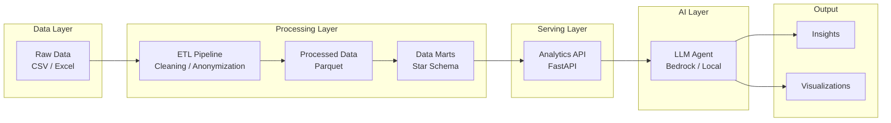

# AI Analytics Agent

An AI-powered analytics system that enables natural language exploration of structured business data using an ETL-based data pipeline, semantic analytics API, and LLM-driven insights generation.

Table Of Content:
1. [Business Context](#business-context)
2. [Features](#features)
3. [Architecture](#architecture)
   - [Architecture Diagram](#architecture-diagram)
4. [Data Handling](#data-handling)
    - [Data Sources](#data-sources)
    - [Data Processing Flow](#data-processing-flow)
    - [Data Warehouse (Star Schema)](#data-warehouse-star-schema)
    - [Data Model](#data-model)
5. [Setup](#setup)
6. [Changelog and State](#changelog-and-state)
7. [Other](#other)
    - [Data processed examples](#data-processed-examples)
    - [Dim data examples](#dim-data-examples)


---

## Business Context

Modern analytics systems often suffer from fragmented data sources, inconsistent metrics definitions, and high dependency on engineering teams for insights generation.

This project simulates an airline retail analytics environment and demonstrates how an AI layer can simplify data exploration and reporting.

---

## Features

- ETL pipeline for structured data preparation
- Layered data architecture (raw → processed → marts)
- Analytics API for metric computation
- LLM-based natural language interface
- Automated insight generation and reporting

---

## Architecture

The system follows a layered architecture:

- **Data Layer**: raw transactional datasets (CSV → parquet)
- **Processing Layer**: ETL transformations and data modeling
- **Serving Layer**: Analytics API exposing business metrics
- **AI Layer**: LLM-based agent for query interpretation and reasoning

### Architecture Diagram



---

## Data Handling

### Data Processing Flow

Raw transactional data is transformed through an ETL pipeline:

| #  | Step                                     | Project structure | ETL step      |
|----|------------------------------------------|-------------------|---------------|
| 1  | Data ingestion (CSV → raw layer)         | `data/raw`        | E (extract)   |
| 2  | Data cleaning, validation, anonymization | `data/processed`  | T (transform) |
| 3  | Data modeling into analytical marts      | `data/marts`      | L (load)      |

Output: data in a star schema in columnar format (Parquet) stored in `data/marts`

---

### Data Sources

The system is based on synthetic airline retail operations data:

- Flight sales transactions (products sold per flight)
- Passenger occupancy data
- Payment transactions (card/cash simulation)
- Inventory / stock levels per flight
- Flight schedule and route data

---

### Data Processing
As an intermediate step, raw data is transformed into a processed layer stored in Parquet format.

This layer includes:
- cleaned and standardized column names
- normalized data types (dates, numeric fields)
- deterministic anonymization of sensitive fields
- validation and basic quality checks
  - dropping duplicates
  - dropping nan records if present in the required (keys) columns
  - dropping negative values if present in the required (numeric) columns

The processed layer preserves the original granularity of the data while ensuring consistency and usability for downstream analytics.

---

### Data Warehouse (Star Schema)

The following dim tables are part of the data warehouse:

- dim_date - a calendar table with additional dates info (year, weekday etc.)
- dim_load - a table with the loading data (catering route id as connected flights to be catered together)
and loading id (in particular set of trolleys to be dispatched to a plane)
- dim_product - a table with the product catalog
- dim_flight - a table with the flight data incl. line_id (a catering line)


### Data Model

The final analytical layer (data marts) will follow a star schema design, consisting of fact and dimension tables optimized for analytical queries and LLM-driven exploration.


---


## Setup

TBD

## Changelog and State
- 15/04/2026 - added sales data preprocessing and data formatting
- 16/04/2026 - code refactoring and completed data loading, standardization 
- 17/04/2026 - completed data preprocessing step
- 18/04/2026 - added product catalog to the etl processing + dim_product 
- 19/04/2026 - all dims are done (data warehouse step)


Completed:
- data loading
- data staging

In progress:
- data warehouse:
  - dim
  - fact 
  
To be done next (this week):
- data presentation

## Other

### Data processed examples

Flight data example:

```
  flight_no scheduled_date scheduled_time    origin destination class  pax
0     AB133     2026-01-01          22:40  city_001    city_002     Y  174
1     AB134     2026-01-02          05:00  city_002    city_001     Y  166
2     AB714     2026-01-01          09:00  city_001    city_003     Y  125
3     AB715     2026-01-01          13:30  city_003    city_001     Y  174
4     AB141     2026-01-01          22:40  city_001    city_004     Y  174
```

Payment data example:
```
   session_id  load_id                               slip_id flight_no  
0  1770300067     9808  00012190-7095-400d-b3bb-acee00d07eba     AB064   
1  1770300067     9808  00012190-7095-400d-b3bb-acee00d07eba     AB064   
2  1770648682     9914  000133f5-95fb-4a8d-909a-ecaafa7d30af     AB064   
3  1772159581    10394  0002f70b-08ad-4215-b6ac-6e8d58759a1a     AB131   
4  1771332937    10128  0003dfe8-db9c-45d0-831b-04a8c803dd28     AB032 

     origin destination is_offline_mode sales_type payment_type  \
0  city_019    city_001             NaN       Sale         Cash   
1  city_019    city_001             NaN       Sale         Cash   
2  city_019    city_001             NaN       Sale         Cash   
3  city_001    city_002            True       Sale         Card   
4  city_001    city_005             NaN       Sale         Cash   

   purchase_amount card_number_prefix card_type  
0              0.6                NaN       NaN  
1              1.0                NaN       NaN  
2             28.0                NaN       NaN  
3             14.0             457828      visa  
4              7.0                NaN       NaN   
```

Sales data example: 

```
   session_id load_id flight_no    origin destination  \
0  1773148639   10769     AB166  city_001    city_006   
1  1773282427   10813     AB131  city_001    city_002   
2  1773282427   10813     AB131  city_001    city_002   
3  1773282427   10813     AB131  city_001    city_002   
4  1773282427   10813     AB131  city_001    city_002   

                                slip_id sales_type   item_category   item_id  \
0  47828792-6f3c-491b-8fc1-e5eaaacc5a12       Sale   Hot Beverages    150204   
1  60c36a4c-a427-4848-85e1-3db02dae031e       Sale   Hot Beverages    150205   
2  bd00b09a-73db-4bb0-b870-7b0fee6841b2       Sale          Snacks    109779   
3  a526c1c0-a769-4a81-81a0-37fb3c737622       Sale          Bakery  C3L2D042   
4  dcf6f5c7-6648-485d-b111-c177e61126b3       Sale  Cold Beverages    150547   

   price  quantity  purchase_amount  discount_amount       date      time  
0    7.0         1              5.0              2.0 2026-03-10  17:45:00  
1    7.0         1              7.0              0.0 2026-03-12  07:00:00  
2    5.0         1              5.0              0.0 2026-03-12  07:00:00  
3    7.0         1              5.0              2.0 2026-03-12  07:00:00  
4    3.0         1              3.0              0.0 2026-03-12  07:00:00 
```

All datasets are anonymized using deterministic mappings.
Sensitive mappings (e.g. city codes) are externalized and excluded from version control.
To see an example of mapping file, `data/config/mapping_example.json` can be used.

Wastage data example:

```
  load_id flight_no scheduled_date   item_category item_id item_type  \
0    8825     AB452     2026-01-02   Hot Beverages  151281   Ambient   
1    8825     AB452     2026-01-02   Hot Beverages  151282   Ambient   
2    8825     AB452     2026-01-02          Snacks  100744   Ambient   
3    8825     AB452     2026-01-02  Cold Beverages  151287   Ambient   
4    8825     AB452     2026-01-02  Cold Beverages  151288   Ambient   

   load_quantity  quantity  wastage_quantity  fresh_wastage_quantity  \
0              5         0                 0                       0   
1              5         0                 0                       0   
2              4         4                 0                       0   
3              6         1                 0                       0   
4              6         1                 0                       0   

     origin destination  
0  city_001    city_014  
1  city_001    city_014  
2  city_001    city_014  
3  city_001    city_014  
4  city_001    city_014  
```

Schedule data example:
```
  line_id flight_no    origin destination order_id       date      time
0  204153     AB133  city_001    city_002   8777.0 2026-01-01  22:40:00
1  204461     AB714  city_001    city_003   8778.0 2026-01-01  09:00:00
2  204493     AB141  city_001    city_004   8779.0 2026-01-01  22:40:00
3  206623     AB126  city_011    city_001     <NA> 2026-01-01  21:30:00
4  211470     AB112  city_016    city_001     <NA> 2026-01-01  06:05:00
```

Product Catalog data:
```
    item_id status      item_category         is_food  item_type      price 
0   VGSW    Active      BOL Products          True    Fresh Product   17.0 
1   150486  Inactive    Cold Beverages        True    Ambiant Product 5.0 
2   109792  Active      Snacks                True    Ambiant Product 15.0 
3   203167  Active      Gifts and Essentials  False   Product         60.0 
4   109789  Inactive    Gifts and Essentials  True    Ambiant Product 40.0
```
### Dim data examples

_dim_product_
```
product_id  item_id    status         item_category         is_food     item_type  
0           VGSW       Active          BOL Products         True        Fresh Product   
1           150486     Inactive        Cold Beverages       True        Ambiant Product   
2           109792     Active          Snacks               True        Ambiant Product   
3           203167     Active          Gifts and Essentials False       Product   
4           109789     Inactive        Gifts and Essentials True        Ambiant Product     
```
_dim_flight_
```
flight_id  flight_no date           time    origin destination line_id      source  
0           AB133    2026-01-01  22:40:00  city_001    city_002  204153  KNOWN_DATA   
1           AB714    2026-01-01  09:00:00  city_001    city_003  204461  KNOWN_DATA   
2           AB141    2026-01-01  22:40:00  city_001    city_004  204493  KNOWN_DATA   
3           AB126    2026-01-01  21:30:00  city_011    city_001  206623  KNOWN_DATA   
4           AB112    2026-01-01  06:05:00  city_016    city_001  211470  KNOWN_DATA   
```
_dim_date_
```
        date   date_id  year  month  day  weekday weekday_name  is_weekend
0 2025-01-01  20250101  2025      1    1        2    Wednesday       False
1 2025-01-02  20250102  2025      1    2        3     Thursday       False
2 2025-01-03  20250103  2025      1    3        4       Friday       False
3 2025-01-04  20250104  2025      1    4        5     Saturday        True
4 2025-01-05  20250105  2025      1    5        6       Sunday        True
```
_dim_load_
```
  line_id  load_id  load_key
0  204153     8777         1
1  204461     8778         2
2  204493     8779         3
3  206623  UNKNOWN         4
4  211470  UNKNOWN         5
```
