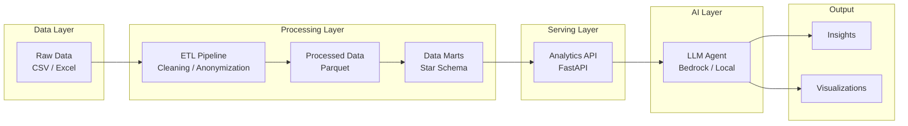
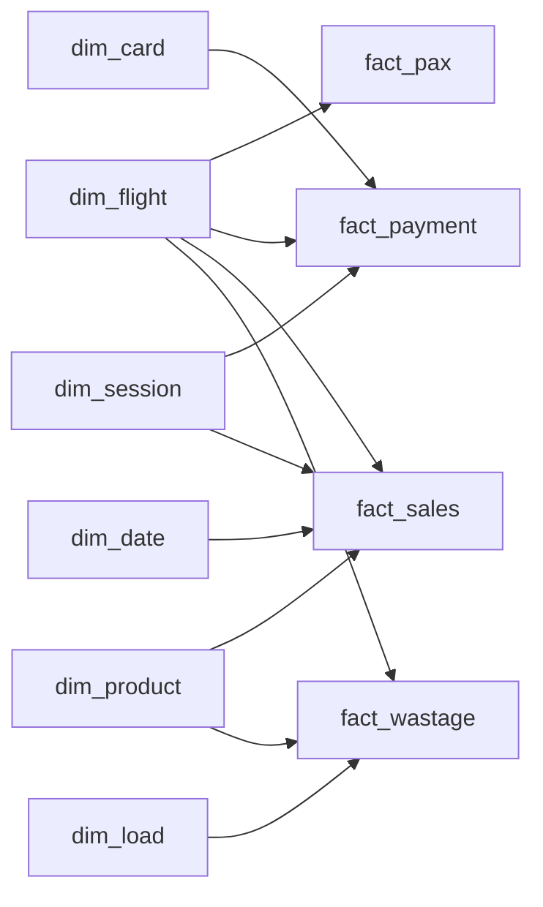

# AI Analytics Agent

An AI-powered analytics system that enables natural language exploration of structured business data using an ETL-based data pipeline, semantic analytics API, and LLM-driven insights generation.

Table Of Content:
1. [Business Context](#business-context)
2. [Features](#features)
3. [Architecture](#architecture)
   - [Architecture Diagram](#architecture-diagram)
4. [Data Handling](#data-handling)
    - [Data Sources](#data-sources)
    - [Data Processing Flow](#data-processing-flow)
    - [Data Warehouse (Star Schema)](#data-warehouse-star-schema)
    - [Data Model](#data-model)
5. [Setup](#setup)
6. [Changelog and State](#changelog-and-state)
7. [Other](#other)
    - [Data Samples](#data-samples)


---

## Business Context

Modern analytics systems often suffer from fragmented data sources, inconsistent metrics definitions, and high dependency on engineering teams for insights generation.

This project simulates an airline retail analytics environment and demonstrates how an AI layer can simplify data exploration and reporting.

---

## Features

- ETL pipeline for structured data preparation
- Layered data architecture (raw → processed → marts)
- Analytics API for metric computation
- LLM-based natural language interface
- Automated insight generation and reporting

---

## Architecture

The system follows a layered architecture:

- **Data Layer**: raw transactional datasets (CSV → parquet)
- **Processing Layer**: ETL transformations and data modeling
- **Serving Layer**: Analytics API exposing business metrics
- **AI Layer**: LLM-based agent for query interpretation and reasoning

### Architecture Diagram



---

## Data Handling

### Data Processing Flow

Raw transactional data is transformed through an ETL pipeline:

| #  | Step                                     | Project structure | ETL step      |
|----|------------------------------------------|-------------------|---------------|
| 1  | Data ingestion (CSV → raw layer)         | `data/raw`        | E (extract)   |
| 2  | Data cleaning, validation, anonymization | `data/processed`  | T (transform) |
| 3  | Data modeling into analytical marts      | `data/marts`      | L (load)      |

Output: data in a star schema in columnar format (Parquet) stored in `data/marts`

---

### Data Sources

The system is based on synthetic airline retail operations data:

- Flight sales transactions (products sold per flight)
- Passenger occupancy data
- Payment transactions (card/cash simulation)
- Inventory / stock levels per flight
- Flight schedule and route data

---

### Data Processing
As an intermediate step, raw data is transformed into a processed layer stored in Parquet format.

This layer includes:
- cleaned and standardized column names
- normalized data types (dates, numeric fields)
- deterministic anonymization of sensitive fields
- cross-source enrichment (e.g. wastage time mapped from schedule based on flight_no + date)
- validation and basic quality checks
  - dropping duplicates
  - dropping nan records if present in the required (keys) columns
  - dropping negative values if present in the required (numeric) columns

The processed layer preserves the original granularity of the data while ensuring consistency and usability for downstream analytics.

---

### Data Warehouse (Star Schema)

The analytical layer follows a star schema design with clearly defined grains for each fact table.

Key modeling principles:
- Facts capture atomic business events at defined grain levels
- Dimensions provide descriptive context
- Independent business contexts (flight, session, load) are modeled as separate dimensions
- Degenerate dimensions (e.g. slip_id) are stored directly in fact tables

The following dim tables are part of the data warehouse:

- dim_date - a calendar table with additional dates info (year, weekday etc.)
- dim_load - a table with the loading data (catering route id as connected flights to be catered together)
and loading id (in particular set of trolleys to be dispatched to a plane)
- dim_product - a table with the product catalog
- dim_flight - a table with the flight data incl. line_id (a catering line
- dim_session - a table with the sales session data
- dim_card - a table with the card data (will be enhanced with the basic bank info)


- fact_payment
- fact_pax
- fact_sale
- fact_wastage

### Fact Table Grains

- fact_pax → flight + class
- fact_payment → payment event (multiple records per slip_id possible)
- fact_sales → item-level transaction (line item)
- fact_wastage → product per flight instance



### Notes on Data Modeling

- `slip_id` is not unique and represents a receipt, not a payment transaction
- multiple payment records can exist per `slip_id`
- therefore, `payment_id` is introduced as a surrogate key in `fact_payment`
- `slip_id` is treated as a degenerate dimension

---

### Data Model

The final analytical layer (data marts) will follow a star schema design, consisting of fact and dimension tables optimized for analytical queries and LLM-driven exploration.

---


## Key Design Decisions

- Star schema chosen for analytical simplicity and performance
- Surrogate keys used for all dimensions
- Fact tables retain business grain and avoid over-normalization
- Multiple independent dimensions (flight, session, load) modeled explicitly
- Columnar storage (Parquet) used for efficient analytical queries

## Setup

### Prerequisites
- Python 3.13+
- Docker & Docker Compose

### Environment Variables

Copy `.env.example` to `.env`. Default values:

| Variable | Default | Description |
|----------|---------|-------------|
| `DB_HOST` | `localhost` | PostgreSQL host |
| `DB_PORT` | `5433` | PostgreSQL port (mapped from container 5432) |
| `DB_NAME` | `ai_analytics` | Main database name |
| `DB_USER` | `postgres` | Database user |
| `DB_PASSWORD` | `postgres` | Database password |
| `SUPERSET_DB_USER` | `superset` | Superset metadata DB user |
| `SUPERSET_DB_PASSWORD` | `superset` | Superset metadata DB password |
| `SUPERSET_DB_NAME` | `superset` | Superset metadata DB name |
| `SUPERSET_SECRET_KEY` | `superset-secret-key-change-in-prod` | Superset secret key |
| `SUPERSET_ADMIN_USER` | `admin` | Superset login username |
| `SUPERSET_ADMIN_PASSWORD` | `admin` | Superset login password |

### Installation & Running

```bash
# 1. Clone and set up Python environment
python -m venv .venv
source .venv/bin/activate
pip install -r requirements.txt

# 2. Copy the environment file
cp .env.example .env

# 3. Start PostgreSQL
docker compose up -d postgres

# 4. Load data into PostgreSQL
python app.py --etl    # full ETL: raw → staging → DWH → marts → DB
# or
python app.py          # load existing parquet files (data/dwh) into DB

# 5. Start Superset (after data is loaded)
docker compose up -d superset

# 6. Open Superset
open http://localhost:8088
# Login: admin / admin
```

### Docker Services

| Service | Image | Port | Purpose |
|---------|-------|------|---------|
| `postgres` | postgres:16 | 5433 | Main data warehouse |
| `superset_db` | postgres:16 | — | Superset metadata store |
| `superset` | apache/superset:3.1.0 | 8088 | BI dashboards |

### Notes
- Step 4 requires raw data files in `data/raw/` (not version-controlled)
- Superset auto-imports dashboards from `services/superset/assets/` on first startup
- To re-import assets, remove the superset container and volume: `docker compose down -v superset superset_db`
- The "Performance Analytics" dashboard includes: Revenue dynamics by Week, Best/Worst Selling Products, Revenue by Products Share

## Changelog and State
- 15/04/2026 - added sales data preprocessing and data formatting
- 16/04/2026 - code refactoring and completed data loading, standardization 
- 17/04/2026 - completed data preprocessing step
- 18/04/2026 - added product catalog to the etl processing + dim_product 
- 19/04/2026 - all dims are done (data warehouse step)
- 26/04/2026 - added additioinal dims, created fact_payment, fact_pax (TBD add dates refs)
- 27/04/2026 - added fact_sales, dim card extended with the bank info
- 29/04/2026 - added fact_wastage, enriched wastage with time from schedule, extended dim_product and dim_flight to cover wastage sources
- 29/04/2026 - added PostgreSQL via Docker, bulk loading with COPY FROM, app entry point with --etl flag
- 01/05/2026 - added PK/FK, indexes, presentation layer with marts 
- 03/05/2026 - added Apache Superset with pre-configured dashboard for key metrics exploration


Completed:
- data loading
- data staging
- dims creation
- data warehouse (all facts done)
- PostgreSQL storage with Docker
- presentation layer (marts)
- PK/FK constraints and indexes
- Superset BI layer with pre-configured dashboard
  
To be done next:
- Analytics API (FastAPI)
- LLM agent integration

## Other

### Data Samples

Sample CSV files (first 5 rows) are auto-generated during ETL and stored alongside the data:

| Layer | Location | Contents |
|-------|----------|----------|
| Processed | `data/processed/samples/` | pax, sales, payments, wastage, schedule, product_catalog, bank |
| DWH | `data/dwh/samples/` | dim_product, dim_flight, dim_date, dim_load, dim_card, dim_session, fact_pax, fact_payment, fact_sales, fact_wastage |
| Marts | `data/marts/samples/` | mart_sales_performance, mart_product_sales, mart_flight_sales |

All datasets are anonymized using deterministic mappings.
Sensitive mappings (e.g. city codes) are externalized and excluded from version control.
To see an example of mapping file, `data/config/mapping_example.json` can be used.  