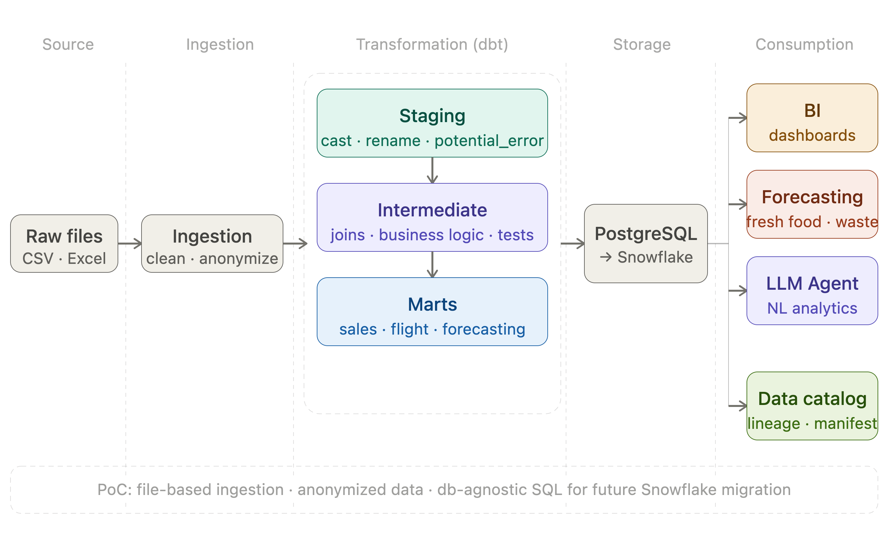
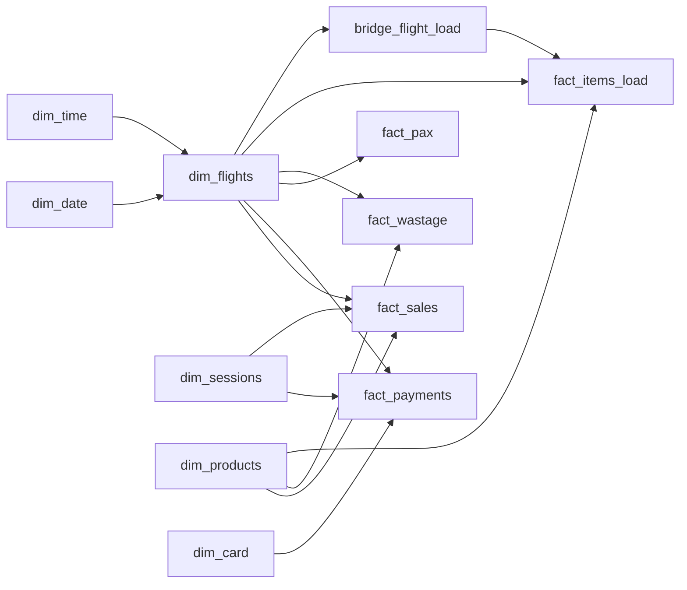
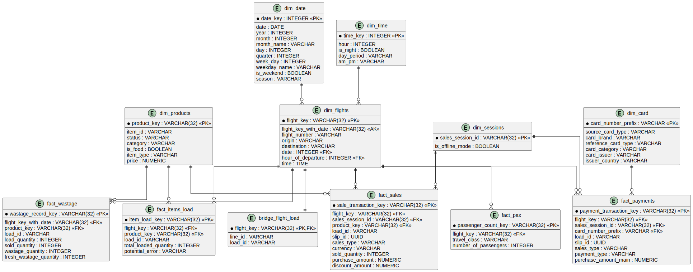
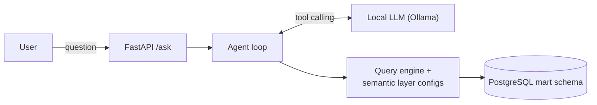

# AI Analytics Agent

An AI-powered analytics system that enables natural language exploration of structured business data using a layered data 
architecture, semantic analytics API, and LLM-driven insights generation.

---

## Table Of Content

1. [Business Context](#business-context)
2. [Features](#features)
3. [Architecture](#architecture)
4. [Data Handling](#data-handling)
5. [Data Warehouse (Star Schema)](#data-warehouse-star-schema)
6. [Data Model (ER Diagram)](#data-model-er-diagram)
7. [AI Analytics Agent](#ai-analytics-agent)
8. [Setup](#setup)
9. [Changelog and State](#changelog-and-state)
10. [Other](#other)

---

## Business Context

Modern analytics systems often suffer from:

* fragmented data sources
* inconsistent metric definitions
* strong dependency on engineers for insights

This project simulates an airline retail analytics environment and demonstrates how an AI layer can simplify data exploration.

---

## Features

* Layered data architecture (raw → staging → intermediate → marts)
* dbt-powered transformations (full ELT in PostgreSQL)
* Star schema data warehouse with bridge tables
* PostgreSQL serving layer with automated testing
* Metadata sync (dbt models & lineage → PostgreSQL)
* Superset BI dashboards
* Fresh food demand forecasting (EDA module)
* (In Progress) ML forecasting models
* **AI analytics agent** - natural language Q&A over the warehouse via a governed semantic layer and a local LLM (FastAPI + Ollama)

---

## Architecture



---

## Data Handling

### Data Processing Flow

| Step | Layer               | Tool      | Description                                      |
|------|---------------------|-----------|--------------------------------------------------|
| 1    | `data/raw`          | Python    | Raw data ingestion (CSV/Excel → PostgreSQL)      |
| 2    | `staging`           | dbt       | Raw data cleaning & standardization              |
| 3    | `intermediate`      | dbt       | Business logic transformations & enrichment      |
| 4    | `marts/dimensions`  | dbt       | Star schema dimensions (SCD Type 1)              |
| 5    | `marts/facts`       | dbt       | Star schema fact tables                          |
| 6    | `marts/bridges`     | dbt       | Bridge tables for many-to-many relationships     |
| 7    | `marts/analytics`   | dbt       | Denormalized analytical tables                   |
| 8    | PostgreSQL          | dbt       | Serving layer with tests & constraints           |

**Architecture**: Pure ELT - all transformations happen in-database via dbt SQL models.

---

### ✅ dbt Migration Completed

The **full migration from Pandas ETL to dbt** is now complete.

**Key advantages achieved:**

1. **Declarative Transformations**
   - SQL-based models with explicit dependencies
   - Version-controlled transformation logic
   - Automatic DAG generation and execution order

2. **Data Quality & Testing**
   - Built-in data quality tests (uniqueness, not_null, relationships)
   - Custom business logic tests
   - Automated test execution with every run

3. **Performance & Scalability**
   - Database-native transformations (no data movement to Python)
   - Incremental models support (future-ready)
   - Materialization strategies (table, view, ephemeral)

4. **Documentation & Lineage**
   - Auto-generated data catalog from model definitions
   - Column-level descriptions and metadata
   - Full lineage tracking (manifest.json → metadata schema)

5. **Developer Experience**
   - Modular SQL with Jinja macros for reusability
   - Easy refactoring with automatic dependency resolution
   - Clear separation of concerns (staging → intermediate → marts)

6. **Observability**
   - Detailed run logs and test results
   - Model-level performance metrics
   - Data freshness checks (future capability)

> The legacy Pandas processing layer has been fully retired. All transformations now run as dbt models in PostgreSQL.

---

### Data Sources

Synthetic airline retail data:

* Flight sales transactions
* Passenger data
* Payment transactions
* Inventory / wastage data
* Flight schedule
* Product catalog
* Bank metadata

---

### Data Processing

The dbt transformation pipeline ensures:

* **Staging layer**: Standardized column names, consistent data types, basic cleaning
* **Intermediate layer**: Business logic transformations, cross-source enrichment, surrogate key generation
* **Marts layer**: Star schema (dimensions + facts), analytical tables, bridge tables
* **Data quality**: Automated tests (uniqueness, relationships, not_null, custom business rules)
* **Validation**: Every model run includes test execution to ensure data integrity

---

## Data Warehouse (Star Schema)

### Dimensions

| Dimension      | Grain                                    | Key Attributes                        |
|----------------|------------------------------------------|---------------------------------------|
| `dim_date`     | One row per calendar date                | year, month, quarter, weekday, season |
| `dim_time`     | One row per hour of day (0-23)           | day_period, is_night, am_pm           |
| `dim_flights`  | One row per flight + date + hour         | flight_number, origin, destination    |
| `dim_products` | One row per item_id                      | category, item_type, price, status    |
| `dim_sessions` | One row per sales_session_id             | is_offline_mode                       |
| `dim_card`     | One row per card_number_prefix (BIN)     | card_brand, issuer, country           |

### Bridge Tables

| Bridge                | Grain                | Purpose                                        |
|-----------------------|----------------------|------------------------------------------------|
| `bridge_flight_load`  | One row per flight   | Links flights to loading context (line_id, load_id) |

### Facts

| Fact              | Grain                                              | Key Measures                        |
|-------------------|----------------------------------------------------|-------------------------------------|
| `fact_sales`      | slip_id + product + sales_type                     | sold_quantity, purchase_amount      |
| `fact_payments`   | slip_id + sales_type + payment_type + card_prefix  | purchase_amount_main                |
| `fact_pax`        | flight + travel_class                              | number_of_passengers                |
| `fact_wastage`    | flight_date + product + load_id                    | load_qty, sold_qty, wastage_qty     |
| `fact_items_load` | flight + load_id + product                         | total_loaded_quantity               |

---

### Dimension-Fact Relationships



---

## Data Model (ER Diagram)



---

## Data Marts

### Analytical Tables

| Mart                        | Grain                 | Purpose                                                |
|-----------------------------|-----------------------|--------------------------------------------------------|
| `mart_fresh_food_order_sale`| flight + item_id      | Fresh food demand forecasting with temporal & route features |

**Schema**: All marts are in the `mart` PostgreSQL schema alongside dimensions and facts.

**Features**:
- Pre-joined dimensional attributes (origin, destination, weekday, hour, etc.)
- Filtered to relevant product categories (Fresh Products, active items)
- Zero-sales included (critical for demand forecasting)
- Optimized for ML model training

---

### Mart Structure

`mart_fresh_food_order_sale` combines:
- Flight context from `bridge_flight_load`
- Flight details from `dim_flights`
- Temporal features from `dim_date` and `dim_time`
- Product attributes from `dim_products`
- Loading data from `fact_items_load` (filter for loaded items)
- Sales actuals from `fact_sales` (aggregated by load_id + product)

This enables forecasting models to predict fresh food demand at the flight-product level.

---

## Metadata Layer

The system automatically extracts metadata from dbt's `manifest.json` and stores it in PostgreSQL for:

* **Model catalog**: all dbt models with attributes (layer, materialization, description, tags)
* **Lineage tracking**: model dependencies for impact analysis

**Schema**: `metadata`
**Tables**:
* `metadata.models` - dbt model registry
* `metadata.dependencies` - model-to-model dependencies

This enables programmatic access to the data model structure, supporting future features like:
* Auto-generated documentation
* Impact analysis queries
* AI agent context for data exploration

---

## Key Design Decisions

* Star schema for analytical clarity
* Surrogate keys for all entities
* Degenerate dimensions (e.g. `slip_id`)
* Columnar storage (Parquet)
* PostgreSQL as serving layer
* Superset as BI layer

---

## AI Analytics Agent

A natural-language interface over the `mart` schema: business users ask questions like *"what's the average
spend per passenger?"* or *"top 10 worst-selling products in Cold Beverages last December"*, and the agent
answers them by calling governed metric queries rather than free-form SQL.

**Business logic**: each business domain (sales, wastage, flight catalog, product catalog, passenger sales)
has a fixed, pre-approved set of metrics and dimensions defined in a semantic layer config. The LLM can only
ever request combinations that already exist there — it cannot invent a metric, join an unrelated table, or
run arbitrary SQL. This gives consistent metric definitions exposed conversationally, without an engineer
writing a one-off query per request.

**Architecture**: a FastAPI endpoint (`POST /ask`) keeps per-conversation message history and drives a
tool-calling loop against a local Ollama model. The LLM picks one of 5 tools (one per domain); each tool call
is validated against that domain's semantic layer YAML and turned into SQL by a generic query engine, reading
directly from the same star schema (`mart.*`) described above — the agent adds no new data, only a
conversational layer on top of the existing warehouse.



**Implementation, setup (LLM config, tool/config details), and current limitations** (in-memory conversation
store, local-model reliability, no auth, etc.) are documented in
[`ai_analytics_agent/README.md`](ai_analytics_agent/README.md).

Run it with:

```bash
make api_agent   # uvicorn ai_analytics_agent.api.app:app --reload --port 8001
```

---

## Setup

### Prerequisites

* Python 3.13+
* Docker & Docker Compose

---

### Installation & Run

```bash
# Install dependencies
make install

# Run full pipeline (start db, load raw data, run dbt, sync metadata)
make run

# Or run steps individually:
make start          # Start PostgreSQL
make load           # Load raw data
make dbt            # Run dbt (deps + seed + run + test)
make metadata-sync  # Sync dbt metadata to PostgreSQL

# Start Superset
docker compose up -d superset
```

Open:

```
http://localhost:8088
```

Login:

```
admin / admin
```

---

## Changelog and State

### Completed

* **Full dbt migration** - Pandas ETL fully replaced with dbt SQL models
* **Star schema warehouse** with dimensions, facts, and bridge tables
* **Data marts** - Analytical tables for forecasting use cases
* **PostgreSQL serving layer** with PK/FK constraints and indexes
* **Automated testing** - dbt tests for data quality (uniqueness, relationships, not_null)
* **Superset dashboards** for BI visualization
* **Metadata sync** - dbt models & lineage → PostgreSQL `metadata` schema
  * `metadata.models` - model catalog with layer, materialization, tags
  * `metadata.dependencies` - full lineage graph
* **Fresh food forecasting module**
  * EDA notebook with 10-section analysis
  * `mart_fresh_food_order_sale` analytical table
  * Feature analysis and model strategy documentation
* **AI analytics agent** - see [AI Analytics Agent](#ai-analytics-agent)
  * Semantic layer configs (metrics, dimensions, joins) for sales, wastage, flights, product catalog, passenger sales
  * FastAPI `/ask` endpoint with conversation history
  * LLM tool-calling agent loop (local Ollama model) + generic SQL query engine
  * Test coverage across tools, llm, api, and utils layers

---

### In Progress

* ML forecasting models (baseline, statistical, tree-based)
* Model evaluation and selection
* Forecasting pipeline automation

---

### Next Steps

* Production forecasting pipeline
* Address AI agent limitations (see [AI Analytics Agent](#ai-analytics-agent) / [`ai_analytics_agent/README.md`](ai_analytics_agent/README.md)): persistent conversation store, retry on empty LLM responses, surfaced error handling, auth

---

## Other

### Data Samples

Data samples can be exported from PostgreSQL using dbt or SQL queries:

```bash
# Export staging models
psql -d ai_analytics -c "COPY staging.stg_sales TO '/tmp/sample_sales.csv' WITH CSV HEADER LIMIT 100"

# Or query directly
psql -d ai_analytics -c "SELECT * FROM mart.dim_flights LIMIT 10"
```

**dbt schemas in PostgreSQL:**
- `staging.*` - Cleaned raw data
- `intermediate.*` - Transformed business entities  
- `mart.*` - Star schema and analytical tables
- `metadata.*` - dbt model catalog and lineage

---

### Notes

* Data is anonymized
* Mapping configs are external (CSV seeds in dbt)
* Raw data is not version-controlled
* All transformations are dbt-based SQL models (ELT architecture)

### Regenerating Diagrams

PlantUML sources are in `docs/diagrams/`. To regenerate SVGs:

```bash
plantuml -tsvg docs/diagrams/*.puml
```
