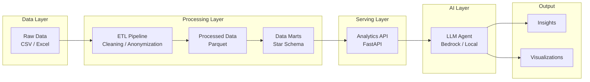

# AI Analytics Agent

An AI-powered analytics system that enables natural language exploration of structured business data using an ETL-based data pipeline, semantic analytics API, and LLM-driven insights generation.

---

## Business Context

Modern analytics systems often suffer from fragmented data sources, inconsistent metrics definitions, and high dependency on engineering teams for insights generation.

This project simulates an airline retail analytics environment and demonstrates how an AI layer can simplify data exploration and reporting.

---

## Features

- ETL pipeline for structured data preparation
- Layered data architecture (raw → processed → marts)
- Analytics API for metric computation
- LLM-based natural language interface
- Automated insight generation and reporting

---

## Architecture

The system follows a layered architecture:

- **Data Layer**: raw transactional datasets (CSV → parquet)
- **Processing Layer**: ETL transformations and data modeling
- **Serving Layer**: Analytics API exposing business metrics
- **AI Layer**: LLM-based agent for query interpretation and reasoning

## Architecture Diagram



---

## Data Handling

### Data Processing Flow

Raw transactional data is transformed through an ETL pipeline:

| #  | Step                                     | Project structure | ETL step      |
|----|------------------------------------------|-------------------|---------------|
| 1  | Data ingestion (CSV → raw layer)         | `data/raw`        | E (extract)   |
| 2  | Data cleaning, validation, anonymization | `data/processed`  | T (transform) |
| 3  | Data modeling into analytical marts      | `data/marts`      | L (load)      |

Output: data in a star schema in columnar format (Parquet) stored in `data/marts`

---

### Data Sources

The system is based on synthetic airline retail operations data:

- Flight sales transactions (products sold per flight)
- Passenger occupancy data
- Payment transactions (card/cash simulation)
- Inventory / stock levels per flight
- Flight schedule and route data

---

### Data Processing
As an intermediate step, raw data is transformed into a processed layer stored in Parquet format.

This layer includes:
- cleaned and standardized column names
- normalized data types (dates, numeric fields)
- deterministic anonymization of sensitive fields
- validation and basic quality checks

The processed layer preserves the original granularity of the data while ensuring consistency and usability for downstream analytics.

Flight data example:

```
  flight_no scheduled_date scheduled_time    origin destination class  pax
0     AB133     2026-01-01          22:40  city_001    city_002     Y  174
1     AB134     2026-01-02          05:00  city_002    city_001     Y  166
2     AB714     2026-01-01          09:00  city_001    city_003     Y  125
3     AB715     2026-01-01          13:30  city_003    city_001     Y  174
4     AB141     2026-01-01          22:40  city_001    city_004     Y  174
```

Payment data example:
```
   session_id  load_id                               slip_id flight_no  
0  1770300067     9808  00012190-7095-400d-b3bb-acee00d07eba     AB064   
1  1770300067     9808  00012190-7095-400d-b3bb-acee00d07eba     AB064   
2  1770648682     9914  000133f5-95fb-4a8d-909a-ecaafa7d30af     AB064   
3  1772159581    10394  0002f70b-08ad-4215-b6ac-6e8d58759a1a     AB131   
4  1771332937    10128  0003dfe8-db9c-45d0-831b-04a8c803dd28     AB032 

     origin destination is_offline_mode sales_type payment_type  \
0  city_019    city_001             NaN       Sale         Cash   
1  city_019    city_001             NaN       Sale         Cash   
2  city_019    city_001             NaN       Sale         Cash   
3  city_001    city_002            True       Sale         Card   
4  city_001    city_005             NaN       Sale         Cash   

   purchase_amount card_number_prefix card_type  
0              0.6                NaN       NaN  
1              1.0                NaN       NaN  
2             28.0                NaN       NaN  
3             14.0             457828      visa  
4              7.0                NaN       NaN   
```


Sales data example: 

```
   session_id load_id flight_no    origin destination  \
0  1773148639   10769     AB166  city_001    city_006   
1  1773282427   10813     AB131  city_001    city_002   
2  1773282427   10813     AB131  city_001    city_002   
3  1773282427   10813     AB131  city_001    city_002   
4  1773282427   10813     AB131  city_001    city_002   

                                slip_id sales_type   item_category   item_id  \
0  47828792-6f3c-491b-8fc1-e5eaaacc5a12       Sale   Hot Beverages    150204   
1  60c36a4c-a427-4848-85e1-3db02dae031e       Sale   Hot Beverages    150205   
2  bd00b09a-73db-4bb0-b870-7b0fee6841b2       Sale          Snacks    109779   
3  a526c1c0-a769-4a81-81a0-37fb3c737622       Sale          Bakery  C3L2D042   
4  dcf6f5c7-6648-485d-b111-c177e61126b3       Sale  Cold Beverages    150547   

   price  quantity  purchase_amount  discount_amount       date      time  
0    7.0         1              5.0              2.0 2026-03-10  17:45:00  
1    7.0         1              7.0              0.0 2026-03-12  07:00:00  
2    5.0         1              5.0              0.0 2026-03-12  07:00:00  
3    7.0         1              5.0              2.0 2026-03-12  07:00:00  
4    3.0         1              3.0              0.0 2026-03-12  07:00:00 
```

All datasets are anonymized using deterministic mappings.
Sensitive mappings (e.g. city codes) are externalized and excluded from version control.
To see an example of mapping file, `data/config/mapping_example.json` can be used.

---

### Data Model

The final analytical layer (data marts) will follow a star schema design, consisting of fact and dimension tables optimized for analytical queries and LLM-driven exploration.


---


## Setup

TBD

## Changelog and State
- 15/04/2026 - added sales data preprocessing and data formatting


Completed:
- data staging:
  - data loading (passengers count, sales, payments)
  - unifying based on naming convention
  - following data type common schema

To be done next (this week):
- data staging:
  - data loading (schedule, wastages)
  - data validation and cleaning: remove duplicates, checking NaN (by black and white listing)
- data presentation:
  - creating schema
  - creating dims
