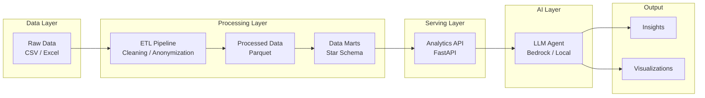
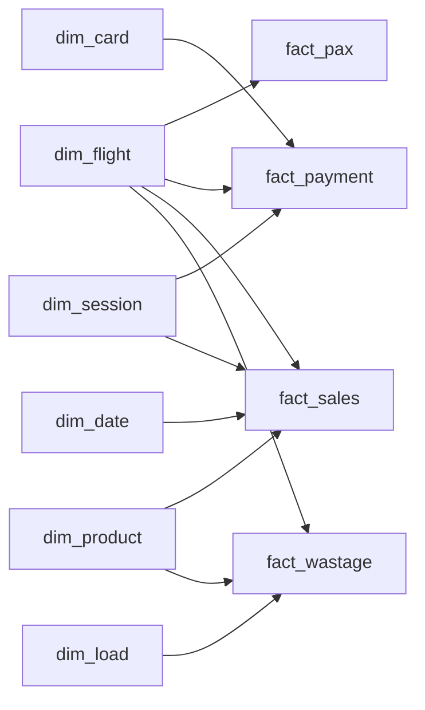

# AI Analytics Agent

An AI-powered analytics system that enables natural language exploration of structured business data using an ETL-based data pipeline, semantic analytics API, and LLM-driven insights generation.

Table Of Content:
1. [Business Context](#business-context)
2. [Features](#features)
3. [Architecture](#architecture)
   - [Architecture Diagram](#architecture-diagram)
4. [Data Handling](#data-handling)
    - [Data Sources](#data-sources)
    - [Data Processing Flow](#data-processing-flow)
    - [Data Warehouse (Star Schema)](#data-warehouse-star-schema)
    - [Data Model](#data-model)
5. [Setup](#setup)
6. [Changelog and State](#changelog-and-state)
7. [Other](#other)
    - [Data processed examples](#data-processed-examples)
    - [Dim data examples](#dim-data-examples)


---

## Business Context

Modern analytics systems often suffer from fragmented data sources, inconsistent metrics definitions, and high dependency on engineering teams for insights generation.

This project simulates an airline retail analytics environment and demonstrates how an AI layer can simplify data exploration and reporting.

---

## Features

- ETL pipeline for structured data preparation
- Layered data architecture (raw → processed → marts)
- Analytics API for metric computation
- LLM-based natural language interface
- Automated insight generation and reporting

---

## Architecture

The system follows a layered architecture:

- **Data Layer**: raw transactional datasets (CSV → parquet)
- **Processing Layer**: ETL transformations and data modeling
- **Serving Layer**: Analytics API exposing business metrics
- **AI Layer**: LLM-based agent for query interpretation and reasoning

### Architecture Diagram



---

## Data Handling

### Data Processing Flow

Raw transactional data is transformed through an ETL pipeline:

| #  | Step                                     | Project structure | ETL step      |
|----|------------------------------------------|-------------------|---------------|
| 1  | Data ingestion (CSV → raw layer)         | `data/raw`        | E (extract)   |
| 2  | Data cleaning, validation, anonymization | `data/processed`  | T (transform) |
| 3  | Data modeling into analytical marts      | `data/marts`      | L (load)      |

Output: data in a star schema in columnar format (Parquet) stored in `data/marts`

---

### Data Sources

The system is based on synthetic airline retail operations data:

- Flight sales transactions (products sold per flight)
- Passenger occupancy data
- Payment transactions (card/cash simulation)
- Inventory / stock levels per flight
- Flight schedule and route data

---

### Data Processing
As an intermediate step, raw data is transformed into a processed layer stored in Parquet format.

This layer includes:
- cleaned and standardized column names
- normalized data types (dates, numeric fields)
- deterministic anonymization of sensitive fields
- validation and basic quality checks
  - dropping duplicates
  - dropping nan records if present in the required (keys) columns
  - dropping negative values if present in the required (numeric) columns

The processed layer preserves the original granularity of the data while ensuring consistency and usability for downstream analytics.

---

### Data Warehouse (Star Schema)

The analytical layer follows a star schema design with clearly defined grains for each fact table.

Key modeling principles:
- Facts capture atomic business events at defined grain levels
- Dimensions provide descriptive context
- Independent business contexts (flight, session, load) are modeled as separate dimensions
- Degenerate dimensions (e.g. slip_id) are stored directly in fact tables

The following dim tables are part of the data warehouse:

- dim_date - a calendar table with additional dates info (year, weekday etc.)
- dim_load - a table with the loading data (catering route id as connected flights to be catered together)
and loading id (in particular set of trolleys to be dispatched to a plane)
- dim_product - a table with the product catalog
- dim_flight - a table with the flight data incl. line_id (a catering line
- dim_session - a table with the sales session data
- dim_card - a table with the card data (will be enhanced with the basic bank info)


- fact_payment
- fact_pax
- fact_sale
- fact_wastage

### Fact Table Grains

- fact_pax → flight + class
- fact_payment → payment event (multiple records per slip_id possible)
- fact_sales → item-level transaction (line item)
- fact_wastage → product per flight instance



### Notes on Data Modeling

- `slip_id` is not unique and represents a receipt, not a payment transaction
- multiple payment records can exist per `slip_id`
- therefore, `payment_id` is introduced as a surrogate key in `fact_payment`
- `slip_id` is treated as a degenerate dimension

---

### Data Model

The final analytical layer (data marts) will follow a star schema design, consisting of fact and dimension tables optimized for analytical queries and LLM-driven exploration.

---


## Key Design Decisions

- Star schema chosen for analytical simplicity and performance
- Surrogate keys used for all dimensions
- Fact tables retain business grain and avoid over-normalization
- Multiple independent dimensions (flight, session, load) modeled explicitly
- Columnar storage (Parquet) used for efficient analytical queries

## Setup

TBD

## Changelog and State
- 15/04/2026 - added sales data preprocessing and data formatting
- 16/04/2026 - code refactoring and completed data loading, standardization 
- 17/04/2026 - completed data preprocessing step
- 18/04/2026 - added product catalog to the etl processing + dim_product 
- 19/04/2026 - all dims are done (data warehouse step)
- 26/04/2026 - added additioinal dims, created fact_payment, fact_pax (TBD add dates refs)
- 27/04/2026 - added fact_sales, dim card extended with the bank info


Completed:
- data loading
- data staging
- dims creation

In progress:
- data warehouse:
  - fact wastage (the last))
  
To be done next:
- data presentation with marts

## Other

### Data processed examples

Flight data example:

```
  flight_no scheduled_date scheduled_time    origin destination class  pax
0     AB133     2026-01-01          22:40  city_001    city_002     Y  174
1     AB134     2026-01-02          05:00  city_002    city_001     Y  166
2     AB714     2026-01-01          09:00  city_001    city_003     Y  125
3     AB715     2026-01-01          13:30  city_003    city_001     Y  174
4     AB141     2026-01-01          22:40  city_001    city_004     Y  174
```

Payment data example:
```
   session_id  load_id                               slip_id flight_no  
0  1770300067     9808  00012190-7095-400d-b3bb-acee00d07eba     AB064   
1  1770300067     9808  00012190-7095-400d-b3bb-acee00d07eba     AB064   
2  1770648682     9914  000133f5-95fb-4a8d-909a-ecaafa7d30af     AB064   
3  1772159581    10394  0002f70b-08ad-4215-b6ac-6e8d58759a1a     AB131   
4  1771332937    10128  0003dfe8-db9c-45d0-831b-04a8c803dd28     AB032 

     origin destination is_offline_mode sales_type payment_type  \
0  city_019    city_001             NaN       Sale         Cash   
1  city_019    city_001             NaN       Sale         Cash   
2  city_019    city_001             NaN       Sale         Cash   
3  city_001    city_002            True       Sale         Card   
4  city_001    city_005             NaN       Sale         Cash   

   purchase_amount card_number_prefix card_type  
0              0.6                NaN       NaN  
1              1.0                NaN       NaN  
2             28.0                NaN       NaN  
3             14.0             457828      visa  
4              7.0                NaN       NaN   
```

Sales data example: 

```
   session_id load_id flight_no    origin destination  \
0  1773148639   10769     AB166  city_001    city_006   
1  1773282427   10813     AB131  city_001    city_002   
2  1773282427   10813     AB131  city_001    city_002   
3  1773282427   10813     AB131  city_001    city_002   
4  1773282427   10813     AB131  city_001    city_002   

                                slip_id sales_type   item_category   item_id  \
0  47828792-6f3c-491b-8fc1-e5eaaacc5a12       Sale   Hot Beverages    150204   
1  60c36a4c-a427-4848-85e1-3db02dae031e       Sale   Hot Beverages    150205   
2  bd00b09a-73db-4bb0-b870-7b0fee6841b2       Sale          Snacks    109779   
3  a526c1c0-a769-4a81-81a0-37fb3c737622       Sale          Bakery  C3L2D042   
4  dcf6f5c7-6648-485d-b111-c177e61126b3       Sale  Cold Beverages    150547   

   price  quantity  purchase_amount  discount_amount       date      time  
0    7.0         1              5.0              2.0 2026-03-10  17:45:00  
1    7.0         1              7.0              0.0 2026-03-12  07:00:00  
2    5.0         1              5.0              0.0 2026-03-12  07:00:00  
3    7.0         1              5.0              2.0 2026-03-12  07:00:00  
4    3.0         1              3.0              0.0 2026-03-12  07:00:00 
```

All datasets are anonymized using deterministic mappings.
Sensitive mappings (e.g. city codes) are externalized and excluded from version control.
To see an example of mapping file, `data/config/mapping_example.json` can be used.

Wastage data example:

```
  load_id flight_no scheduled_date   item_category item_id item_type  \
0    8825     AB452     2026-01-02   Hot Beverages  151281   Ambient   
1    8825     AB452     2026-01-02   Hot Beverages  151282   Ambient   
2    8825     AB452     2026-01-02          Snacks  100744   Ambient   
3    8825     AB452     2026-01-02  Cold Beverages  151287   Ambient   
4    8825     AB452     2026-01-02  Cold Beverages  151288   Ambient   

   load_quantity  quantity  wastage_quantity  fresh_wastage_quantity  \
0              5         0                 0                       0   
1              5         0                 0                       0   
2              4         4                 0                       0   
3              6         1                 0                       0   
4              6         1                 0                       0   

     origin destination  
0  city_001    city_014  
1  city_001    city_014  
2  city_001    city_014  
3  city_001    city_014  
4  city_001    city_014  
```

Schedule data example:
```
  line_id flight_no    origin destination order_id       date      time
0  204153     AB133  city_001    city_002   8777.0 2026-01-01  22:40:00
1  204461     AB714  city_001    city_003   8778.0 2026-01-01  09:00:00
2  204493     AB141  city_001    city_004   8779.0 2026-01-01  22:40:00
3  206623     AB126  city_011    city_001     <NA> 2026-01-01  21:30:00
4  211470     AB112  city_016    city_001     <NA> 2026-01-01  06:05:00
```

Product Catalog data:
```
    item_id status      item_category         is_food  item_type      price 
0   VGSW    Active      BOL Products          True    Fresh Product   17.0 
1   150486  Inactive    Cold Beverages        True    Ambiant Product 5.0 
2   109792  Active      Snacks                True    Ambiant Product 15.0 
3   203167  Active      Gifts and Essentials  False   Product         60.0 
4   109789  Inactive    Gifts and Essentials  True    Ambiant Product 40.0
```

Bank data:
```  
card_number_prefix          brand   type category   issuer country_short  \
0              19627  PRIVATE LABEL  DEBIT  UNKNOWN  UNKNOWN           USA   
1              21502  PRIVATE LABEL  DEBIT  UNKNOWN  UNKNOWN           USA   
2              42410  PRIVATE LABEL  DEBIT  UNKNOWN  UNKNOWN           USA   
3              57164  PRIVATE LABEL  DEBIT  UNKNOWN  UNKNOWN           USA   
4              63047           VISA  DEBIT  UNKNOWN  UNKNOWN           USA   

         country  
0  United States  
1  United States  
2  United States  
3  United States  
4  United States  
```

### Dim data examples

_dim_product_
```
  item_id    status         item_category  is_food        item_type  \
0    VGSW    Active          BOL Products     True    Fresh Product   
1  150486  Inactive        Cold Beverages     True  Ambiant Product   
2  109792    Active                Snacks     True  Ambiant Product   
3  203167    Active  Gifts and Essentials    False          Product   
4  109789  Inactive  Gifts and Essentials     True  Ambiant Product   

                     product_sur_id  
0  b44f73bacabcef8ce63ce1d60e21a4f8  
1  ea579e44dd150e5ba6680d6a3cee26b4  
2  fbd5478e90f9f68d038f7fa5996bcbff  
3  9806a5b9c7557ba40b34a967c88a70a5  
4  ead848fd8f4b78e1fdc32c4a5088e15e       
```
_dim_flight_
```
  flight_no        date      time    origin destination line_id      source  \
0     AB133  2026-01-01  22:40:00  city_001    city_002  204153  KNOWN_DATA   
1     AB714  2026-01-01  09:00:00  city_001    city_003  204461  KNOWN_DATA   
2     AB141  2026-01-01  22:40:00  city_001    city_004  204493  KNOWN_DATA   
3     AB126  2026-01-01  21:30:00  city_011    city_001  206623  KNOWN_DATA   
4     AB112  2026-01-01  06:05:00  city_016    city_001  211470  KNOWN_DATA   

                      flight_sur_id  
0  3631901103e5f460541040525ed22bef  
1  111422977e25fcbd60dfabb0a7291d2f  
2  b6c1028337e26a4124708ed87ac8bb05  
3  ea6a3221a4679ff3b4e6e6d248dff55c  
4  06f74a1815abcd701b3bd3b6f2040d45     
```
_dim_date_
```
        date  date_sur_id  year  month  day  weekday weekday_name  is_weekend
0 2025-01-01     20250101  2025      1    1        2    Wednesday       False
1 2025-01-02     20250102  2025      1    2        3     Thursday       False
2 2025-01-03     20250103  2025      1    3        4       Friday       False
3 2025-01-04     20250104  2025      1    4        5     Saturday        True
4 2025-01-05     20250105  2025      1    5        6       Sunday        True
```
_dim_load_
```
  line_id  load_id                       load_sur_id
0  204153     8777  9399e0b02c73fcc14cd11d9b4e685f2e
1  204461     8778  34d94cf9ca228a78848313df32d668d1
2  204493     8779  3368986bdca0efedda1eda8d39b3ae6c
3  206623  UNKNOWN  696b031073e74bf2cb98e5ef201d4aa3
4  211470  UNKNOWN  696b031073e74bf2cb98e5ef201d4aa3
```

_dim_card_
```
  card_number_prefix card_type       brand    type    category  \
0             457828      visa        VISA  CREDIT     UNKNOWN   
1             552191        mc  MASTERCARD  CREDIT    PLATINUM   
2             518084        mc  MASTERCARD  CREDIT     UNKNOWN   
3             552102        mc  MASTERCARD  CREDIT  WORLD CARD   
4             454946      visa        VISA  CREDIT     UNKNOWN   

                      issuer country_short               country  \
0          UNITED BANK, LTD.           ARE  United Arab Emirates   
1          EMIRATES NBD BANK           ARE  United Arab Emirates   
2  JPMORGAN CHASE BANK, N.A.           USA         United States   
3      HSBC BANK MIDDLE EAST           ARE  United Arab Emirates   
4                 WOORI BANK           KOR           SOUTH KOREA   

                       card_sur_key  
0  eff1c240dd7293f6c2fc5d393ed2c853  
1  71e838e87dcf21205855fd66b09fb549  
2  9e289bcadae37d6f2a126d5a014b0490  
3  e711247de3b8e9731ee9eace2882beab  
4  f68aed6f87b6edb83f9ebf49f1909880  
```

_dim_session_
```
  session_id  is_offline_mode                    session_sur_id
0  1770300067            False  0ba06e52adc81a2286f934d1ae1be26d
2  1770648682            False  53c11a1608cc174944c0067c422acda9
3  1772159581             True  50fbb9f6ae94adec6275f6a1061f1a0f
4  1771332937            False  58ecf3e2745839b4bfb067ccc8fd5885
5   770805007             True  9d8749a7d66a71c247a9a5264a5ed437
```

_fact_pax_
```
                         flight_key class  pax_qty  date_key  \
0  3631901103e5f460541040525ed22bef     Y      174  20260101   
1  ca711382fcaad8a669fa09fb96c98cf8     Y      166  20260102   
2  111422977e25fcbd60dfabb0a7291d2f     Y      125  20260101   
3  9569980288b95e36e1e37cbff37fa91f     Y      174  20260101   
4  b6c1028337e26a4124708ed87ac8bb05     Y      174  20260101   

                         pax_sur_id  
0  320110a380795bb8296d09854d665c15  
1  c8ce489ae492fd5201725c76a65b8fab  
2  d811c47ac126aaf69f956684147d724f  
3  918f22795db9d0a32fe46ead65573422  
4  9a6a4c82b513f5863efe575b095f3b0e  
```

_fact_payment_
```
                          payment_id                               slip_id  \
0  61760892f03d467c5998be1b3603e5ea  00012190-7095-400d-b3bb-acee00d07eba   
1  61760892f03d467c5998be1b3603e5ea  00012190-7095-400d-b3bb-acee00d07eba   
2  93931a5985d157eef6f7b6ae15ecdc52  000133f5-95fb-4a8d-909a-ecaafa7d30af   
3  3ea11fa175a31e7af43180cc9b7ab711  0002f70b-08ad-4215-b6ac-6e8d58759a1a   
4  2b6356220d4d26143a6a54e538b74d05  0003dfe8-db9c-45d0-831b-04a8c803dd28   

                        session_key                        flight_key  \
0  0ba06e52adc81a2286f934d1ae1be26d  179f98714611110a7420907b16aad82c   
1  0ba06e52adc81a2286f934d1ae1be26d  179f98714611110a7420907b16aad82c   
2  53c11a1608cc174944c0067c422acda9  d495b0d4011aef6de2d2f88696bcc012   
3  50fbb9f6ae94adec6275f6a1061f1a0f  6313a3cbe34398e296a84f99041a2d0b   
4  58ecf3e2745839b4bfb067ccc8fd5885  eaa159caac51166500226c9b028874eb   

  sales_type payment_type  purchase_amount                          card_key  \
0       Sale         Cash              0.6                               NaN   
1       Sale         Cash              1.0                               NaN   
2       Sale         Cash             28.0                               NaN   
3       Sale         Card             14.0  eff1c240dd7293f6c2fc5d393ed2c853   
4       Sale         Cash              7.0                               NaN   

   date_key  
0  20260205  
1  20260205  
2  20260209  
3  20260227  
4  20260217  
```

_fact_sales_
```
                        session_key                        flight_key  \
0  cfd2e10e565673f1781448f5bcc5c720  a00ac4804b446daaf5dc71839c92e85c   
1  b74409fe219c8c3ee986b4cbd0521e4a  b697c28c79e6cc17861087e48852b961   
2  b74409fe219c8c3ee986b4cbd0521e4a  b697c28c79e6cc17861087e48852b961   
3  b74409fe219c8c3ee986b4cbd0521e4a  b697c28c79e6cc17861087e48852b961   
4  b74409fe219c8c3ee986b4cbd0521e4a  b697c28c79e6cc17861087e48852b961   

                                slip_id sales_type  \
0  47828792-6f3c-491b-8fc1-e5eaaacc5a12       Sale   
1  60c36a4c-a427-4848-85e1-3db02dae031e       Sale   
2  bd00b09a-73db-4bb0-b870-7b0fee6841b2       Sale   
3  a526c1c0-a769-4a81-81a0-37fb3c737622       Sale   
4  dcf6f5c7-6648-485d-b111-c177e61126b3       Sale   

                        product_key  price  quantity  purchase_amount  \
0  256739145ec11049c9deba2041b9e640    7.0         1              5.0   
1  92beef6f29f3a4b88f8b278c9e9672ea    7.0         1              7.0   
2  20d4c2d722de8dd0f1ec4e055d9b639e    5.0         1              5.0   
3  796cc52f7bf5d4aa53a48400ce43f0b1    7.0         1              5.0   
4  e24193c120eb4ec01bacb50550a3e7c5    3.0         1              3.0   

   discount_amount  date_key                          sales_id  
0              2.0  20260310  48da602762e181cfcdb392f051803ac4  
1              0.0  20260312  c51032d6da1894daa65b4fd474f395d1  
2              0.0  20260312  9ef1ab985deef4c741fcdffe8281a2c9  
3              2.0  20260312  50e08e707f610dbae1b926b54870e4a7  
4              0.0  20260312  b9254cd740d8556c2a6cdb4bb901aa62
```  