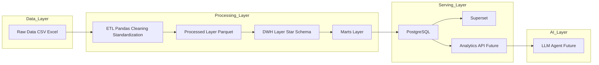
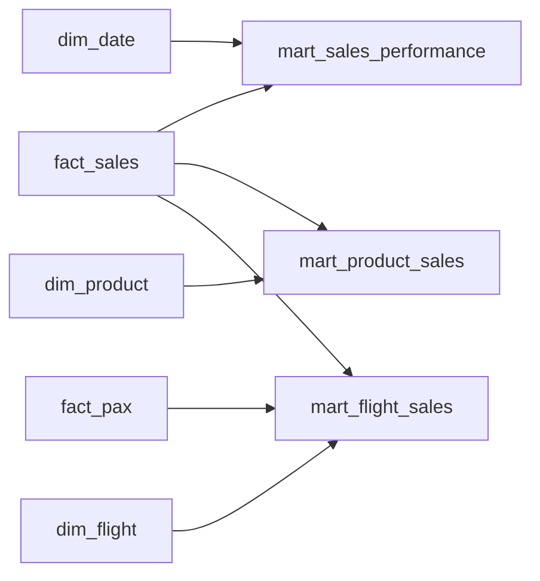

# AI Analytics Agent

An AI-powered analytics system that enables natural language exploration of structured business data using a layered data 
architecture, semantic analytics API, and LLM-driven insights generation.

---

## Table Of Content

1. [Business Context](#business-context)
2. [Features](#features)
3. [Architecture](#architecture)
4. [Data Handling](#data-handling)
5. [Data Warehouse (Star Schema)](#data-warehouse-star-schema)
6. [Data Model (ER Diagram)](#data-model-er-diagram)
7. [Setup](#setup)
8. [Changelog and State](#changelog-and-state)
9. [Other](#other)

---

## Business Context

Modern analytics systems often suffer from:

* fragmented data sources
* inconsistent metric definitions
* strong dependency on engineers for insights

This project simulates an airline retail analytics environment and demonstrates how an AI layer can simplify data exploration.

---

## Features

* Layered data architecture (raw → processed → DWH → marts)
* ETL pipeline for structured data preparation
* Star schema data warehouse
* PostgreSQL serving layer
* Superset BI dashboards
* (Planned) Analytics API
* (Planned) LLM-powered analytics agent

---

## Architecture



---

## Data Handling

### Data Processing Flow

| Step | Layer            | Description                                   |
| ---- | ---------------- | --------------------------------------------- |
| 1    | `data/raw`       | Raw CSV / Excel files                         |
| 2    | `data/processed` | Cleaned & standardized data (temporary layer) |
| 3    | `data/dwh`       | Star schema (dims + facts)                    |
| 4    | `data/marts`     | Aggregated analytical tables                  |
| 5    | PostgreSQL       | Serving layer                                 |

---

### ⚠️ Important Note on Processing Layer

The **processed layer (Parquet + Pandas)** is currently a **temporary implementation**.

Planned evolution:

* Replace Pandas transformations with **SQL-based transformations inside the data warehouse**
* Move toward:

  * ELT instead of ETL
  * dbt / SQL models (or similar approach)
  * database-native joins and aggregations

> Pandas is used here as a prototyping tool, not as a final data processing engine.

---

### Data Sources

Synthetic airline retail data:

* Flight sales transactions
* Passenger data
* Payment transactions
* Inventory / wastage data
* Flight schedule
* Product catalog
* Bank metadata

---

### Data Processing

The processed layer ensures:

* standardized column names
* consistent data types
* anonymization
* cross-source enrichment
* basic data quality checks:

  * drop duplicates
  * drop invalid NULLs
  * filter negative values

---

## Data Warehouse (Star Schema)

### Dimensions

* `dim_date`
* `dim_flight`
* `dim_product`
* `dim_session`
* `dim_card`
* `dim_load`

### Facts

* `fact_sales`
* `fact_payment`
* `fact_pax`
* `fact_wastage`

---

### Fact Table Grains

| Table        | Grain                  |
| ------------ | ---------------------- |
| fact_sales   | item-level transaction |
| fact_payment | payment event          |
| fact_pax     | flight + class         |
| fact_wastage | product per flight     |

---

## Data Model (ER Diagram)

```mermaid
erDiagram

    dim_date {
        int date_sur_id PK
        date date
        int year
        int month
        int day
        int weekday
        string weekday_name
        string is_weekend
    }

    dim_flight {
        string flight_sur_id PK
        string flight_no
        date date
        string time
        string origin
        string destination
        string line_id
        string source
    }

    dim_product {
        string product_sur_id PK
        string item_id
        string status
        string item_category
        string is_food
        string item_type
    }

    dim_session {
        string session_sur_id PK
        string session_id
        string is_offline_mode
    }

    dim_card {
        string card_sur_key PK
        string card_number_prefix
        string card_type
        string brand
        string issuer
        string country
    }

    dim_load {
        string load_sur_id PK
        string line_id
        string load_id
    }

    fact_sales {
        string sales_sur_id PK
        string flight_key FK
        string session_key FK
        string product_key FK
        string slip_id
        string sales_type
        float price
        int sold_quantity
        float purchase_amount
        float discount_amount
        int date_key FK
    }

    fact_payment {
        string payment_sur_id PK
        string flight_key FK
        string session_key FK
        string card_key FK
        string slip_id
        string payment_type
        float purchase_amount
        int date_key FK
    }

    fact_pax {
        string pax_sur_id PK
        string flight_key FK
        string class
        int pax_quantity
        int date_key FK
    }

    fact_wastage {
        string wastage_sur_id PK
        string flight_key FK
        string item_key FK
        int load_quantity
        int sold_quantity
        int wastage_quantity
        int fresh_wastage_quantity
        int date_key FK
    }

    dim_flight ||--o{ fact_sales
    dim_flight ||--o{ fact_payment
    dim_flight ||--o{ fact_pax
    dim_flight ||--o{ fact_wastage

    dim_product ||--o{ fact_sales
    dim_product ||--o{ fact_wastage

    dim_session ||--o{ fact_sales
    dim_session ||--o{ fact_payment

    dim_card ||--o{ fact_payment

    dim_date ||--o{ fact_sales
    dim_date ||--o{ fact_payment
    dim_date ||--o{ fact_pax
    dim_date ||--o{ fact_wastage
```

---

## Data Marts



### Available Marts

* `mart_sales_performance`
* `mart_product_sales`
* `mart_flight_sales`

---

## Key Design Decisions

* Star schema for analytical clarity
* Surrogate keys for all entities
* Degenerate dimensions (e.g. `slip_id`)
* Columnar storage (Parquet)
* PostgreSQL as serving layer
* Superset as BI layer

---

## Setup

### Prerequisites

* Python 3.13+
* Docker & Docker Compose

---

### Installation & Run

```bash
# Start database
docker compose up -d postgres

# Run full pipeline
python app.py --etl

# Start Superset
docker compose up -d superset
```

Open:

```
http://localhost:8088
```

Login:

```
admin / admin
```

---

## Changelog and State

### Completed

* ETL pipeline
* Data staging layer
* Data warehouse (star schema)
* PostgreSQL loading (COPY)
* PK/FK constraints and indexes
* Data marts
* Superset dashboards

---

### In Progress

* Data model stabilization
* Migration from Pandas → SQL transformations

---

### Next Steps

* Analytics API (FastAPI)
* Semantic layer (metrics definitions)
* LLM agent integration

---

## Other

### Data Samples

| Layer     | Location                  |
| --------- | ------------------------- |
| Processed | `data/processed/samples/` |
| DWH       | `data/dwh/samples/`       |
| Marts     | `data/marts/samples/`     |

---

### Notes

* Data is anonymized
* Mapping configs are external
* Raw data is not version-controlled
* Processed layer is temporary and will be replaced with SQL-based transformations
