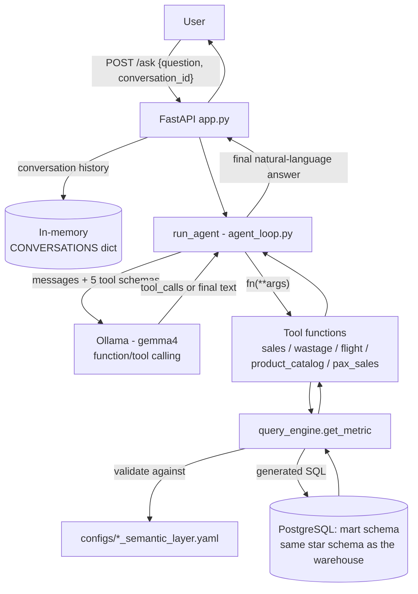

# AI Analytics Agent

A natural-language interface over the airline retail data warehouse. Users ask business questions in plain
English; the agent translates them into governed metric queries against the `mart` schema and answers in
natural language.

---

## Table of Contents

1. [Business Logic & Examples](#business-logic--examples)
2. [Architecture](#architecture)
3. [Implementation Logic](#implementation-logic)
4. [Setup Details](#setup-details)
5. [Current Limitations](#current-limitations)

---

## Business Logic & Examples

Instead of writing SQL against the star schema directly, business users ask questions like:

| Question | Domain | What happens |
|---|---|---|
| "How much revenue did we make in December, broken down by category?" | sales | `get_sales_metric(metrics=["revenue"], group_by=["category"], filters={"month": 12})` |
| "What's the average spend and average items per passenger?" | pax_sales | `get_pax_sales_metric(metrics=["avg_sales_per_passenger", "avg_items_per_passenger"])` |
| "Top 10 worst-selling products in Cold Beverages, sorted ascending" | sales | `get_sales_metric(metrics=["sales_quantity"], filters={"category": "Cold Beverages"}, order_by={"sales_quantity": "asc"}, limit=10)` |
| "How many flights were night flights last year?" | flights | `get_flight_catalog_metric(metrics=["flight_count"], filters={"year": 2025, "is_night": true})` |
| "What's our sell-through rate on fresh products?" | wastage | `get_wastage_metric(metrics=["fresh_wastage_rate"])` |

Each domain has a fixed, pre-approved set of **metrics** (e.g. `revenue`, `sell_through_rate`) and
**dimensions** (e.g. `year`, `category`, `route`) it can be sliced by — the LLM can only ever request
combinations that already exist in that domain's semantic layer. It cannot invent a metric, join an
unrelated table, or write arbitrary SQL. This is the core business value: **consistent, governed metric
definitions**, exposed conversationally, without engineers writing one-off queries per request.

---

## Architecture



The agent is a thin layer on top of the existing data warehouse: it does not duplicate data, it reads
directly from the `mart` schema (facts, dimensions, bridges) documented in the top-level project README.

---

## Implementation Logic

**High-level request flow:**

1. Client sends a question (and optionally a `conversation_id`) to `POST /ask`.
2. `api/app.py` looks up prior history for that `conversation_id` (or starts fresh), appends the new user
   message, and calls `run_agent(history)`.
3. `run_agent()` builds the 5 tool schemas from the semantic layer configs, prepends a system prompt
   (behavior rules for the model), and enters a tool-calling loop with the LLM.
4. On each turn, the LLM either replies with plain text (loop ends) or requests a tool call.
5. A requested tool call is executed, validated, and turned into SQL by the generic query engine; results
   go back to the LLM as a `tool` message.
6. The loop repeats (capped at `MAX_ITERATIONS = 5`) until the LLM produces a final natural-language answer.
7. The full updated message history is stored back under the `conversation_id` and returned to the client.

**Tool-call execution, in more detail** (`tools/query_engine.py:get_metric`):

1. Load and validate the domain's semantic layer YAML (`config_handler.get_semantic_layer`).
2. Validate the LLM's requested `metrics` / `group_by` / `filters` / `order_by` / `limit` all exist in that
   semantic layer (`_validate_args`) — this is the safety boundary preventing arbitrary queries.
3. Build the `SELECT`, `JOIN` (only the joins actually required by the requested dimensions, in the
   config's declared `join_order`), `WHERE`, `GROUP BY`, `ORDER BY`, and `LIMIT` clauses from the config.
4. Execute via SQLAlchemy against the read-only `mart` schema and return rows as JSON-serializable dicts.

---

## Setup Details

### LLM setup

* Runs against a local [Ollama](https://ollama.com) server — no external API calls.
* Model is set in `llm/client.py` (`MODEL = "gemma4"`); swap by changing that constant (other models used
  during development are left commented out there: `qwen2.5:14b-instruct`, `qwen3:14b`).
* Tool-call turns run with `think=False` and a lowered `options={"temperature": 0.2}` (set in
  `agent_loop.py`) — the default model temperature (`1.0`) is fine for chat but too high for reliable
  tool-result summarization.
* The system prompt (`agent_loop.SYSTEM_PROMPT`) explicitly tells the model to call tools directly with
  sensible defaults rather than asking the user for filters it didn't request, and to always produce a
  written answer after a tool result rather than an empty response.

### Tools

Five tools are registered with the LLM, one per business domain, each built dynamically from its semantic
layer at `run_agent()` call time (`llm/client.py`):

| Tool function | Domain constant | Fact table |
|---|---|---|
| `get_sales_metric` | `sales` | `mart.fact_sales` |
| `get_wastage_metric` | `wastage` | `mart.fact_wastage` |
| `get_flight_catalog_metric` | `flights` | `mart.dim_flights` |
| `get_product_catalog_metric` | `product_catalog` | `mart.dim_products` |
| `get_pax_sales_metric` | `pax_sales` | `mart.mart_pax_sales` |

Each tool's JSON schema (metrics enum, dimensions enum for `group_by`/`filters`) is generated straight from
the corresponding YAML config, so adding a metric/dimension to a config makes it immediately available to
the LLM without touching `client.py`.

### Semantic layer configs

Location: `ai_analytics_agent/configs/<domain>_semantic_layer.yaml`. Required structure:

```yaml
from: "mart.some_fact f"          # base FROM clause

metrics:
  some_metric:
    type: simple                   # simple | ratio
    sql: "SUM(f.some_column)"      # required for type: simple
  some_ratio:
    type: ratio
    numerator: "SUM(f.a)"          # required for type: ratio
    denominator: "SUM(f.b)"        # required for type: ratio

dimensions:
  some_dimension:
    select: "d.some_column"        # required
    requires: [some_join]          # required — list of join keys this dimension needs

joins:
  some_join: "JOIN mart.some_dim d ON d.key = f.key"

join_order: [some_join]            # every key in `joins` MUST also appear here, and vice versa
```

`config_handler._validate_semantics()` enforces this shape at load time (raises `ValidationError` on any
mismatch, e.g. a join defined but missing from `join_order`) — see
`ai_analytics_agent/utils/tests/test_config_handler.py` for the full validation contract, which is also
regression-tested against all five real configs.

### Environment / database access

DB connection env vars (`.env`, read in `utils/database.py`):

```
AGENT_DB_HOST=localhost
AGENT_DB_PORT=5433
AGENT_DB_NAME=ai_analytics
AGENT_DB_USER=agent_readonly
AGENT_DB_PASSWORD=...
```

The agent connects with a dedicated **read-only** role, scoped to the `mart` schema only:

```sql
CREATE ROLE agent_readonly WITH LOGIN PASSWORD 'readonly';
GRANT USAGE ON SCHEMA mart TO agent_readonly;
GRANT SELECT ON ALL TABLES IN SCHEMA mart TO agent_readonly;
ALTER DEFAULT PRIVILEGES IN SCHEMA mart GRANT SELECT ON TABLES TO agent_readonly;
```

### Running

```bash
make api_agent   # uvicorn ai_analytics_agent.api.app:app --reload --port 8001
```

Swagger UI: `http://127.0.0.1:8001/docs`

### Tests

```bash
pytest ai_analytics_agent/tools ai_analytics_agent/llm ai_analytics_agent/api ai_analytics_agent/utils
```

* `tools/tests/` — SQL-building/validation unit tests, plus `@pytest.mark.integration` tests that hit the
  real DB for each domain's tool function.
* `llm/tests/`, `api/tests/`, `utils/tests/` — fully mocked (no Ollama, no DB): tool-schema construction,
  the agent loop's tool-calling/error/iteration-cap behavior, the `/ask` endpoint's conversation-history
  handling, and semantic layer config validation for all five real domains.

---

## Current Limitations

* **In-memory conversation store** — `CONVERSATIONS` in `api/app.py` is a plain process-local dict: history
  is lost on server restart and won't work correctly across multiple workers/processes.
* **Local model non-determinism** — `gemma4` can occasionally return an empty final message (no text, no
  tool call) even after a tool call succeeded. There is currently no retry-on-empty-response handling.
* **Errors are not surfaced to the user** — if a tool raises, the exception is caught and fed back to the
  LLM as `{"error": ...}`; whether the user ever sees a meaningful message depends entirely on the LLM
  choosing to mention it. There's no logging or direct error surfacing at the API layer.
* **No conversation trimming** — full history is resent to the LLM on every turn with no size cap or
  summarization, so long conversations grow the prompt indefinitely.
* **No auth or rate limiting** on the `/ask` endpoint.
* **Fixed `MAX_ITERATIONS = 5`** tool-calling loop — a question that legitimately needs more chained tool
  calls than that will return `"No response was generated after all allowed iterations"`.
* **Five fixed domains only** — no ad-hoc cross-domain joins beyond what's already encoded in each
  semantic layer's `from`/`joins` (e.g. sales cannot currently be joined against pax_sales in one query).
