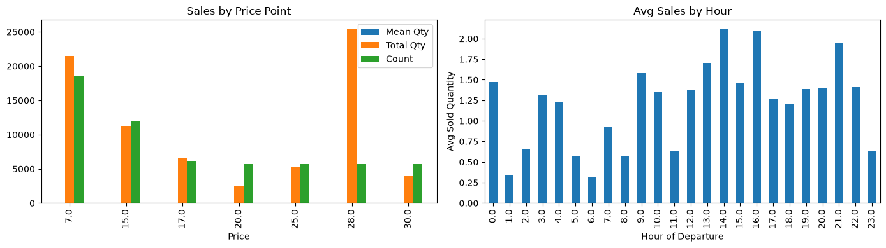
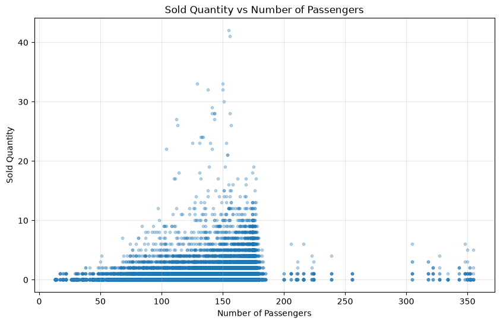
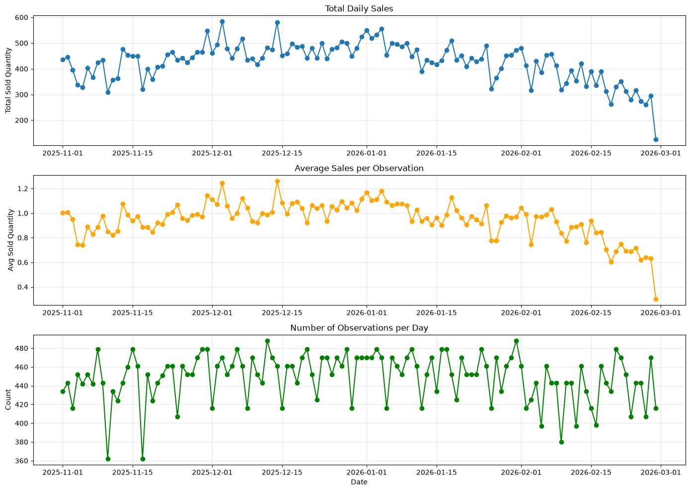

# Fresh Food Sales Forecasting - Exploratory Data Analysis

## Purpose

This exploratory data analysis (EDA) investigates fresh food sales patterns on flights to:
- Understand the statistical distribution and relationships within the data
- Identify potentially useful features for demand forecasting models
- Determine appropriate modeling approaches based on data characteristics
- Detect and document data quality issues

## Data Source

**Mart**: `mart_fresh_food_order_sale`  
**Grain**: One row per flight-product combination  
**Period**: 4 months (limited seasonality analysis)  
**Total Records**: 59,610 (after cleaning)

**Sample Record:**

| flight_key  | flight_number | origin   | destination | date       | item_id   | category | price | sold_quantity | number_of_passengers |
|-------------|---------------|----------|-------------|------------|-----------|----------|-------|---------------|----------------------|
| c02f71...   | AB134         | city_002 | city_001    | 2025-11-02 | C3L2D037  | Bakery   | 7.0   | 0.0           |  175.0               |

## Data Cleaning

**Steps applied:**

1. **Duplicate Check**: No duplicates found at grain level (flight_key + item_id)
2. **Potential Errors Filtered**: ~10 records flagged as _no_pax_data_ (new flights without passenger history) 
and about 10 records were marked as zero_pax_count (potentially a data quality issue) were excluded from training dataset.
3. **Missing Value Check**: No missing values in analysis dataset (post-filtering)

---

## Data Statistics

### Feature Summary

| Column                   | Data Type | Nulls  | Unique Values | Description                                                                    |
|--------------------------|-----------|--------|---------------|--------------------------------------------------------------------------------|
| **flight_key**           | str       | 0      | 6,193         | Unique flight instance identifier (surrogate key: flight_number + date + hour) |
| **flight_number**        | str       | 0      | 86            | Flight route identifier (e.g., AB134)                                          |
| **origin**               | str       | 0      | 29            | Departure airport/city code                                                    |
| **destination**          | str       | 0      | 30            | Arrival airport/city code                                                      |
| **date**                 | datetime  | 0      | 120           | Flight date (calendar day)                                                     |
| **month_name**           | str       | 0      | 4             | Month name (November, December, January, February)                             |
| **year**                 | float     | 0      | 2             | Year (2025, 2026) - limited temporal signal                                    |
| **weekday_name**         | str       | 0      | 7             | Day of week (Monday through Sunday)                                            |
| **is_weekend**           | bool      | 0      | 2             | Weekend indicator (Saturday/Sunday = True)                                     |
| **hour_of_departure**    | float     | 0      | 24            | Departure hour (0-23, rounded from departure time)                             |
| **day_period**           | str       | 0      | 4             | Time period (Night, Morning, Day, Evening)                                     |
| **is_night**             | bool      | 0      | 2             | Night flight indicator (22:00-04:59 = True)                                    |
| **am_pm**                | str       | 0      | 2             | AM/PM indicator                                                                |
| **number_of_passengers** | float     | 0      | 187           | Total passengers on flight (summed across all travel classes)                  |
| **item_id**              | str       | 0      | 10            | Product identifier (Fresh Product SKU)                                         |
| **category**             | str       | 0      | 6             | Product category (Bakery, Sandwiches, etc.)                                    |
| **price**                | float     | 0      | 7             | Product unit price                                                             |
| **sold_quantity**        | float     | 0      | 33            | **TARGET**: Number of units sold (0 = no sales)                                |
| **potential_error**      | str       | 59,610 | 0             | Data quality flag (filtered out for analysis)                                  |

#### Key Observations

**Temporal Coverage:**
- 4-month analysis window (limited for seasonality detection)
- 120 unique dates
- All 7 weekdays represented

**Route Coverage:**
- 86 unique flight numbers
- 29 origin cities, 30 destination cities
- ~58 unique routes (origin-destination pairs)

**Product Coverage:**
- 10 fresh food products
- 6 product categories
- 7 distinct price points (7.0 to 30.0)

**Passenger Load:**
- 187 unique passenger count values
- Includes actual counts and flight-number-based averages

**Target Variable (sold_quantity):**
- 33 unique values (0 to 42 units)
- Severe zero-inflation (~63.5% zero sales)
- Right-skewed distribution (mean > median)

Conclusion: 
Based on the target variable statistics, all type of the linear models (Lasso, Ridge etc.) can be excluded 
as they don’t perform well on the zero-inflated datasets. Additionally, all types of optimizations based on MSE (mean square error) 
or RMSE (root mean square error) can’t be taken for the model development, as such algorithms put high penalties to the outlier cases.
Therefore, they will systematically lead to the overpredicts zeros and ones.

## Target Analysis (sold_quantity)

### Descriptive Statistics

| Statistic   | sold_quantity | 
|-------------|---------------|
| **count**   | 59,610        | 
| **mean**    | 0.64          | 
| **std**     | 1.37          | 
| **min**     | 0.00          | 
| **25%**     | 0.00          | 
| **50%**     | 0.00          | 
| **75%**     | 1.00          | 
| **max**     | 42.00         | 

| Feature                  | Skewness | Kurtosis | Zero Values    |
|--------------------------|----------|----------|----------------|
| **sold_quantity**        | 6.99     | 104.56   | 37,830 (63.5%) |

Zero sales: 37,830 (63.5%)
Non-zero sales: 21,780 (36.5%)

Percentile distribution:
-  10%: 0.0
-  25%: 0.0
-  50%: 0.0
-  75%: 1.0
-  90%: 2.0
-  95%: 3.0
-  99%: 6.0

Distribution Characteristics:
- High variability: Standard deviation (1.37) is 214% of mean (0.64)
- Severe right skew (6.99): Long tail of high-value outliers 
- Extreme kurtosis (104.56): Very sharp peak with extremely heavy tails
- Severe zero-inflation: 63.5% of observations have zero sales
- Outliers right skewed: 1% of observations includes 6–42 units, forming a heavy tail that dominates the outlier structure.

Key Statistics:
- 75% of sales ≤ 1 unit (highly concentrated at zero and low values)
- Maximum of 42 units represents significant outlier
- Median (0.0) < Mean (0.64) confirms severe right skew and zero-inflation

### Target outliers analysis

**Outlier Detection (IQR Method):**

Calculation:
- Q1 (25th percentile) = 0.00
- Q3 (75th percentile) = 1.00
- IQR = Q3 - Q1 = 1.00
- Lower bound = Q1 - 1.5 × IQR = 0 - 1.5 = -1.5
- Upper bound = Q3 + 1.5 × IQR = 1 + 1.5 = 2.5

**Outlier Range:** Values < -1.5 or > 2.5

**Results:**
- Total outliers detected: 3,488 (5,9% of dataset)
- All outliers are upper outliers (> 2.5 units)
- No lower outliers (minimum value is 0.00)

**Box Plot Observations:**
- Extremely narrow box (Q1=0, Q3=1): 50% of data concentrated in 0-1 unit range
- No lower whisker: Median at zero reflects severe zero-inflation
- Short upper whisker extending to 2.5
- Numerous points beyond upper bound: Heavy right tail with values up to 42 units

## Numerical features analysis

There are 3 numerical features present in the dataset:
- price - item price. Not a categorical feature (for 10 different products - 7 different prices)
- hour_of_departure - rounded hour value (in case of 23:30 is rounded to 23 and all other values are rounded mathematically)
- number_of_passengers - number of passengers checked in for a given flight

The dataset covers the period from November 2025 to March 2026. 
The year feature was excluded from analysis as it takes only two values whose distribution is entirely determined by the data collection timeframe and carries no independent predictive signal.

| Statistic   | price     | hour_of_departure | number_of_passengers |
|-------------|-----------|-------------------|----------------------|
| **count**   | 59,610    | 59,610            | 59,610               |
| **mean**    | 16.85     | 13.05             | 154.56               |
| **std**     | 8.18      | 6.44              | 31.11                |
| **min**     | 7.00      | 0.00              | 13.00                |
| **25%**     | 7.00      | 9.00              | 145.00               |
| **50%**     | 15.00     | 14.00             | 168.00               |
| **75%**     | 25.00     | 19.00             | 174.00               |
| **max**     | 30.00     | 23.00             | 355.00               |

### Distribution Shape Metrics

| Feature                  | Skewness | Kurtosis | Zero Values  | Interpretation                  |
|--------------------------|----------|----------|--------------|---------------------------------|
| **price**                | 0.20     | -1.27    | 0 (0.0%)     | Nearly symmetric, flat peak     |
| **hour_of_departure**    | -0.11    | -0.99    | 1,240 (2.1%) | Nearly symmetric, flat peak     |
| **number_of_passengers** | -1.08    | 4.66     | 0 (0.0%)     | Left skew, sharp peak           |

**1. price**

Distribution Characteristics:
- Moderate variability: Standard deviation (8.18) is 49% of mean (16.85)
- Nearly symmetric (skewness: 0.20): Mean ≈ Median
- Platykurtic (kurtosis: -1.27): Flat distribution, few extreme values
- No zeros: All products have positive pricing

Key Statistics:
- Price range: 7 - 30 (7 distinct price points)
- Median: 15 (midpoint of range)
- IQR: 7 - 25 (captures 50% of data)

**2. hour_of_departure**

Distribution Characteristics:
- Moderate variability: Standard deviation (6.44) is 49% of mean (13.06)
- Nearly symmetric (skewness: -0.11): Uniform flight distribution across day
- Platykurtic (kurtosis: -0.99): Flat distribution, consistent coverage
- Midnight flights: 1,240 observations (2.1%) at hour 0

Key Statistics:
- Hour range: 0-23 (full 24-hour coverage)
- Median: 14:00 (afternoon peak)
- IQR: 09:00 - 19:00 (daytime operations)

**3. number_of_passengers**

Distribution Characteristics:
- Low variability: Standard deviation (31.11) is only 20% of mean (154.56)
- Left skew (-1.08): Concentration at higher passenger counts
- Leptokurtic (4.66): Sharp peak with moderate tails
- Suspicious zeros: were excluded from the dataset

Key Statistics:
- Passenger range: 13 - 355
- Median: 168 passengers (close to mean, high load factor)
- IQR: 145 - 174 (tight clustering around high occupancy)

### Correlation Analysis

Correlation with sold_quantity:

| Metric               | Correlation |
|----------------------|-------------|
| price                | 0.12        |
| hour_of_departure    | 0.07        |
| number_of_passengers | 0.03        |
| year                 | -0.02       |

Correlation analysis revealed no meaningful linear relationship between the target and numerical features. 
Only price shows a weak positive correlation (r = 0.15), while hour_of_departure and number_of_passengers are near zero. 
However, low linear correlation does not exclude non-linear structure, which is evident across all three features.

Sales by Price Point confirms that sales volume varies considerably across the seven discrete price values. 
The lowest price tier (7–15) accounts for the highest number of records and total sales,
while the mid-range values (17–25) show significantly lower activity. 
This pattern suggests a potential dependency between price groups and sales volume, which will be further verified through binning into low, medium, and high price tiers.

Average Sales by Hour reveals a clear intra-day pattern. 
Sales are relatively low during early morning hours (1–8am), rise through the midday period, and peak around 14:00–16:00, before declining again toward midnight. 
This non-uniform distribution motivates the derivation of a day_part categorical feature for further analysis.

Sold Quantity vs Number of Passengers shows a positive relationship between passenger count and sales volume up to approximately 170–180 passengers, 
beyond which sales drop sharply to near zero. 
This threshold effect suggests that flight capacity alone does not drive sales — other factors likely dominate for high-capacity flights. 
The scatter plot also highlights several extreme sales values for low-to-mid capacity flights, consistent with the outlier structure identified earlier.

## Categorical Features Analysis

The categorical feature set covers item identifiers, route information (origin, destination), 
and temporal markers (day period, weekday, weekend flag, night flag). 
Cardinality is moderate across all features and presents no technical concerns. 
The weekend and weekday features provide full coverage of all calendar days as expected given the dataset timeframe.

### Sales by Item

| item_id   | avg_qty   | total_qty   | observations  | avg_price   |
|-----------|-----------|-------------|---------------|-------------|
| T3L4D007  | 2.23      | 12,760      | 5,729         | 28.0        |
| C3L2D037  | 0.64      | 3,986       | 6,193         | 7.0         |
| C3L2D041  | 0.63      | 3,904       | 6,193         | 7.0         |
| T3L4D129  | 0.58      | 3,333       | 5,729         | 15.0        |
| C3L2W121  | 0.53      | 3,291       | 6,193         | 17.0        |
| C3L2D043  | 0.46      | 2,878       | 6,193         | 7.0         |
| T3L4D008  | 0.47      | 2,665       | 5,729         | 25.0        |
| T3L4S016  | 0.37      | 2,306       | 6,193         | 15.0        |
| T3L4D127  | 0.35      | 2,028       | 5,729         | 30.0        |
| C3L2W161  | 0.22      | 1,252       | 5,729         | 20.0        |

`T3L4D007` is the clear sales leader with an average of 2.23 units per observation (including zeros), totalling 12,760 units — over 3x the next best item. 
Notably, this item also carries one of the highest price points (28.0), suggesting that demand is largely price-inelastic for this product. 
The zero-inclusive average of 2.23 indicates relatively strong sales volume compared to other items, though overall demand has decreased significantly.

In contrast, `C3L2W161`, `T3L4D127`, and `T3L4S016` show low average quantities despite having comparable or higher observation counts, meaning these items are frequently loaded but rarely sold. 
This pattern is independent of price — the low-performing group includes both budget (7.0) and expensive (30.0) items — suggesting that product type rather than price drives demand for these SKUs. 
The distribution of sales across items will be a key signal for the predictive model and warrants item-level feature engineering.

### Sales by Day Period

| day_period  | mean  | sum    | count  |
|-------------|-------|--------|--------|
| Day         | 1.02  | 16,811 | 16,415 |
| Evening     | 0.66  | 6,857  | 10,425 |
| Morning     | 0.47  | 9,647  | 20,585 |
| Night       | 0.42  | 5,088  | 12,185 |

The day period feature shows a clear relationship with sales performance. 
Daytime observations record the highest mean sold quantity (1.02), followed by Evening (0.66). 
Morning observations are the most frequent in the dataset (20,585 records) yet yield a substantially lower mean (0.47) — 
despite having nearly twice the number of observations as Evening, total morning sales exceed evening sales by only ~41%.
This gap between volume and mean performance suggests that morning flights are structurally weaker in terms of per-observation sales conversion. 
Night period records the lowest mean (0.42), consistent with reduced passenger appetite during overnight travel.

### Sales by Weekend

| is_weekend      | mean   | sum    | count   |
|-----------------|--------|--------|---------|
| False (weekday) | 0.64   | 26,912 | 41,750  |  
| True (weekend)  | 0.64   | 11,491 | 17,860  |

The weekend flag shows no difference in mean sales between weekday and weekend (both 0.64) observations. 
Given the absence of any meaningful signal, this feature is unlikely to contribute predictive value and may be excluded from modelling 
unless interaction effects with other features are identified at a later stage.

### Feature Binning Analysis

#### Passenger Count 

To capture the non-linear relationship between passenger load and sales, 
the number_of_passengers feature was discretized into four bins reflecting the operational capacity characteristics of the A320/A321 fleet.

To capture the non-linear relationship between passenger load and sales, the `number_of_passengers` feature was 
cut into four bins reflecting the operational capacity characteristics of the A320/A321 fleet.

| Bin     | total_sales   | flights_count  | avg_sale_per_flight   | avg_sale_per_pax   |
|---------|---------------|----------------|-----------------------|--------------------|
| 0–100   | 1,931         | 4,775          | 0.40                  | 0.0053             |
| 100–150 | 9,118         | 12,600         | 0.72                  | 0.0056             |
| 150–180 | 27,153        | 41,930         | 0.65                  | 0.0038             |
| 180+    | 201           | 305            | 0.66                  | 0.0025             |

Two distinct patterns emerge from the analysis.
The average sales per passenger decreases monotonically across bins — from 0.0053 in the lowest load segment to 0.0025 for flights above 180 passengers
— suggesting that individual purchase probability declines as cabin occupancy increases, likely due to reduced crew availability 
per passenger and shorter effective service windows on high-load flights.

Average sales per flight, however, follow a non-monotonic pattern, peaking in the 100–150 passenger range (0.72 units) rather than at maximum capacity. 
The 150–180 bin dominates in total volume purely due to flight frequency — it contains the largest share of observations, consistent with typical A320/A321 operating loads.

The scatter plot effect observed in the earlier analysis — an apparent relationship up to ~175 passengers followed by relatively stable performance — is partly a frequency artifact: 
high-capacity flights (180+) are rare in this dataset (305 flights), and their average sales (0.66) reflect both sparse data and a genuine per-passenger decline. 
The `pax_bin` feature is retained for modelling as each segment exhibits a distinguishable sales profile.

#### Price

The `price` feature was discretized into three bins: Low (≤7), Medium (8–17), and High (18–30).

| price_bin   |  mean |  sum   | count  |
|-------------|-------|--------|--------|
| Low         | 0.58  | 10,768 | 18,579 |
| Medium      | 0.49  | 8,930  | 18,115 |
| High        | 0.81  | 18,643 | 22,916 |

The initial analysis suggested that high-priced items outperform lower price tiers (mean 0.81 vs 0.58). 
However, this result is driven entirely by a single item `T3L4D007` (price=28.0) which was identified earlier as a strong sales outlier. 
Excluding this item reveals the opposite pattern:

| price_bin | mean (excl. T3L4D007) |
|-----------|-----------------------|
| Low       | 0.58                  |
| Medium    | 0.49                  |
| High      | 0.32                  |

For the remaining 9 products, sales decrease monotonically with price — a pattern consistent with standard price elasticity of demand in an onboard retail context. 
This finding suggests that `price_bin` carries a meaningful signal only in conjunction with `item_id`, 
and that the two features should be considered together rather than independently in the modelling stage.

### Sales by Route, Origin and Destination

Analysis is based on the top 10 routes, origins, and destinations by total sales volume.

#### Top 10 Routes by Total Sales

| Route                | avg_qty_per_flight  | total_qty   | num_flights   |
|----------------------|---------------------|-------------|---------------|
| city_001 -> city_002 | 6.12                | 1,984       | 324           |
| city_001 -> city_008 | 6.80                | 1,878       | 276           |
| city_017 -> city_001 | 15.12               | 1,845       | 122           |
| city_003 -> city_001 | 13.22               | 1,600       | 121           |
| city_001 -> city_017 | 13.30               | 1,596       | 120           |
| city_001 -> city_003 | 11.78               | 1,425       | 121           |
| city_001 -> city_011 | 4.75                | 1,419       | 299           |
| city_001 -> city_005 | 11.25               | 1,328       | 118           |
| city_001 -> city_018 | 15.33               | 1,318       | 86            |
| city_020 -> city_001 | 10.72               | 1,233       | 115           |

Route-level analysis reveals considerable variation in both total and average sales across directions.  
The `city_017 <-> city_001` corridor records high average sales per flight (~14.2 units), with city_001 -> city_018 showing the highest per-flight average (15.33) among top routes. 
The `city_003 <-> city_001` corridor also shows relatively strong performance (11.78-13.22 units per flight).

The `city_001 -> city_002` and `city_001 -> city_008` routes dominate in total volume due to high flight frequency (324 and 276 flights respectively), 
but record lower per-flight averages (6.12 and 6.80 units), suggesting these high-frequency routes have lower conversion rates. 
The `city_001 -> city_011` route shows the lowest per-flight average (4.75 units) among top routes.

Route symmetry (outbound and return pairs) is less pronounced in the current dataset, with some variation between directions — 
for example, city_017 -> city_001 (15.12) vs city_001 -> city_017 (13.30), though both remain in similar performance bands.

#### Top Origins and Destinations

Origins and destinations show patterns consistent with the hub-and-spoke structure centered on `city_001`. 
This city dominates in total volume (22,641 units from origin, 15,827 units to destination) due to its role as the primary hub. 
Among non-hub cities, `city_017` (15.12 avg from origin, 13.30 avg to destination), `city_003`, and `city_018` lead in average sales per flight, 
while `city_002` and `city_011` show high total volume but low per-flight averages — consistent with the route-level findings above.

> **Note on dataset structure:** The current dataset is aggregated at the individual flight level. 
> If model performance is insufficient, an alternative aggregation at the route level (combining outbound and return segments as a single catering line) may be considered, 
> reflecting the operational reality that catering for both directions is planned simultaneously at the hub.

### Time Series Analysis

Temporal analysis across weekdays and months reveals no consistent patterns in sales behaviour. 
Daily sales volume and average sales per observation remain relatively stable throughout the observation period (November 2025 – February 2026), 
with no pronounced weekly or monthly seasonality detected. 
The sharp decline observed at the end of February 2026 is attributable to incomplete data for the final days of the observation period and is excluded from trend interpretation. 
Given the short timeframe of the dataset, month-level aggregations reflect calendar effects of a single cycle rather than repeatable seasonal trends, limiting their predictive utility.

## Conclusion

The exploratory analysis identifies `item_id`, `route`, `day_period`, and `pax_bin` as the most informative features for demand forecasting, while `is_weekend`, `weekday_name`, 
and temporal features show no meaningful predictive signal and are candidates for exclusion.

Key findings that directly shape the modelling approach:

- The target variable shows severe zero-inflation (63.5% zeros) with extreme right skew, ruling out standard regression approaches and MSE-based optimization
- `T3L4D007` remains a structural outlier that disproportionately influences price-level aggregations — item identity must be treated as a primary feature rather than a proxy
- Passenger load exhibits a non-linear threshold effect with an optimal sales conversion window of 100–150 passengers, motivating the use of `pax_bin` over the raw continuous feature
- Route-level variation is substantial with notable directional asymmetries, particularly for hub routes — route identity carries strong predictive signal
- Price elasticity is product-dependent and cannot be interpreted independently of `item_id`
- Overall sales levels are significantly lower than historical patterns, with mean sales at 0.64 units per observation vs previous periods

Based on these characteristics, the modelling stage will evaluate the following approaches: 
a historical mean baseline aggregated at flight-product level, KNN, Random Forest, Poisson regression, and a two-stage classifier-regressor pipeline. 
If flight-level granularity proves insufficient, dataset re-aggregation at the route level will be considered as an alternative modelling unit.