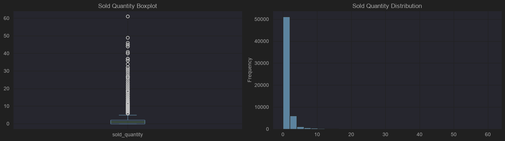

# Fresh Food Sales Forecasting - Exploratory Data Analysis

## Purpose

This exploratory data analysis (EDA) investigates fresh food sales patterns on flights to:
- Understand the statistical distribution and relationships within the data
- Identify potentially useful features for demand forecasting models
- Determine appropriate modeling approaches based on data characteristics
- Detect and document data quality issues

## Data Source

**Mart**: `mart_fresh_food_order_sale`  
**Grain**: One row per flight-product combination  
**Period**: 4 months (limited seasonality analysis)  
**Total Records**: ~59,630 (after cleaning)

**Sample Record:**

| flight_key  | flight_number | origin   | destination | date       | item_id   | category | price | sold_quantity | number_of_passengers |
|-------------|---------------|----------|-------------|------------|-----------|----------|-------|---------------|----------------------|
| c02f71...   | AB134         | city_002 | city_001    | 2025-11-02 | C3L2D037  | Bakery   | 7.0   | 0.0           |  175.0               |

## Data Cleaning

**Steps applied:**

1. **Duplicate Check**: No duplicates found at grain level (flight_key + item_id)
2. **Potential Errors Filtered**: ~10 records flagged as _no_pax_data_ (new flights without passenger history) were excluded from training dataset
3. **Missing Value Check**: No missing values in analysis dataset (post-filtering)

---

## Data Statistics

### Feature Summary

| Column                   | Data Type | Nulls  | Unique Values | Description                                                                    |
|--------------------------|-----------|--------|---------------|--------------------------------------------------------------------------------|
| **flight_key**           | str       | 0      | 6,194         | Unique flight instance identifier (surrogate key: flight_number + date + hour) |
| **flight_number**        | str       | 0      | 86            | Flight route identifier (e.g., AB134)                                          |
| **origin**               | str       | 0      | 29            | Departure airport/city code                                                    |
| **destination**          | str       | 0      | 30            | Arrival airport/city code                                                      |
| **date**                 | datetime  | 0      | 120           | Flight date (calendar day)                                                     |
| **month_name**           | str       | 0      | 4             | Month name (November, December, January, February)                             |
| **year**                 | float     | 0      | 2             | Year (2025, 2026) - limited temporal signal                                    |
| **weekday_name**         | str       | 0      | 7             | Day of week (Monday through Sunday)                                            |
| **is_weekend**           | bool      | 0      | 2             | Weekend indicator (Saturday/Sunday = True)                                     |
| **hour_of_departure**    | float     | 0      | 24            | Departure hour (0-23, rounded from departure time)                             |
| **day_period**           | str       | 0      | 4             | Time period (Night, Morning, Day, Evening)                                     |
| **is_night**             | bool      | 0      | 2             | Night flight indicator (22:00-04:59 = True)                                    |
| **am_pm**                | str       | 0      | 2             | AM/PM indicator                                                                |
| **number_of_passengers** | float     | 0      | 188           | Total passengers on flight (summed across all travel classes)                  |
| **item_id**              | str       | 0      | 10            | Product identifier (Fresh Product SKU)                                         |
| **category**             | str       | 0      | 6             | Product category (Bakery, Sandwiches, etc.)                                    |
| **price**                | float     | 0      | 7             | Product unit price                                                             |
| **sold_quantity**        | float     | 0      | 43            | **TARGET**: Number of units sold (0 = no sales)                                |
| **potential_error**      | str       | 59,620 | 0             | Data quality flag (filtered out for analysis)                                  |

#### Key Observations

**Temporal Coverage:**
- 4-month analysis window (limited for seasonality detection)
- 120 unique dates
- All 7 weekdays represented

**Route Coverage:**
- 86 unique flight numbers
- 29 origin cities, 30 destination cities
- ~58 unique routes (origin-destination pairs)

**Product Coverage:**
- 10 fresh food products
- 6 product categories
- 7 distinct price points (7.0 to 30.0)

**Passenger Load:**
- 188 unique passenger count values
- Range: 0 to 355 passengers - (TO BE CHECKED ABOUT 0 CASES)
- Includes actual counts and flight-number-based averages

**Target Variable (sold_quantity):**
- 43 unique values (0 to 61 units)
- High zero-inflation (~40% zero sales)
- Right-skewed distribution (mean > median)

Conclusion: 
Based on the target variable statistics, all type of the linear models (Lasso, Ridge etc.) can be excluded 
as they don’t perform well on the zero-inflated datasets. Additionally, all types of optimizations based on MSE (mean square error) 
or RMSE (root mean square error) can’t be taken for the model development, as such algorithms put high penalties to the outlier cases.
Therefore, they will systematically lead to the overpredicts zeros and ones.

### Numerical Features Summary

| Statistic   | sold_quantity | price    | hour_of_departure | number_of_passengers |
|-------------|---------------|----------|-------------------|----------------------|
| **count**   | 59,620        | 59,620   | 59,620            | 59,620               |
| **mean**    | 1.29          | 16.85    | 13.06             | 154.53               |
| **std**     | 2.18          | 8.18     | 6.44              | 31.17                |
| **min**     | 0.00          | 7.00     | 0.00              | 0.00                 |
| **25%**     | 0.00          | 7.00     | 9.00              | 145.00               |
| **50%**     | 1.00          | 15.00    | 14.00             | 168.00               |
| **75%**     | 2.00          | 25.00    | 19.00             | 174.00               |
| **max**     | 61.00         | 30.00    | 23.00             | 355.00               |

#### Distribution Shape Metrics

| Feature                  | Skewness | Kurtosis | Zero Values    | Interpretation                  |
|--------------------------|----------|----------|----------------|---------------------------------|
| **price**                | 0.20     | -1.27    | 0 (0.0%)       | Nearly symmetric, flat peak     |
| **hour_of_departure**    | -0.11    | -0.99    | 1,240 (2.1%)   | Nearly symmetric, flat peak     |
| **number_of_passengers** | -1.09    | 4.70     | 10 (0.0%)      | Left skew, sharp peak           |

**1. price**

Distribution Characteristics:
- Moderate variability: Standard deviation (8.18) is 49% of mean (16.85)
- Nearly symmetric (skewness: 0.20): Mean ≈ Median
- Platykurtic (kurtosis: -1.27): Flat distribution, few extreme values
- No zeros: All products have positive pricing

Key Statistics:
- Price range: 7 - 30 (7 distinct price points)
- Median: 15 (midpoint of range)
- IQR: 7 - 25 (captures 50% of data)

**2. hour_of_departure**

Distribution Characteristics:
- Moderate variability: Standard deviation (6.44) is 49% of mean (13.06)
- Nearly symmetric (skewness: -0.11): Uniform flight distribution across day
- Platykurtic (kurtosis: -0.99): Flat distribution, consistent coverage
- Midnight flights: 1,240 observations (2.1%) at hour 0

Key Statistics:
- Hour range: 0-23 (full 24-hour coverage)
- Median: 14:00 (afternoon peak)
- IQR: 09:00 - 19:00 (daytime operations)

**3. number_of_passengers**

Distribution Characteristics:
- Low variability: Standard deviation (31.17) is only 20% of mean (154.53)
- Left skew (-1.09): Concentration at higher passenger counts
- Leptokurtic (4.70): Sharp peak with moderate tails
- Suspicious zeros: 10 observations (0.0%) with 0 passengers

Key Statistics:
- Passenger range: 0 - 355
- Median: 168 passengers (close to mean, high load factor)
- IQR: 145 - 174 (tight clustering around high occupancy)

**Data Quality Concerns:**
- **0 passengers**: Likely data quality issue (flights with sales but no passenger data)

### Target analysis (sold_quantity)

| Statistic   | sold_quantity | 
|-------------|---------------|
| **count**   | 59,620        | 
| **mean**    | 1.29          | 
| **std**     | 2.18          | 
| **min**     | 0.00          | 
| **25%**     | 0.00          | 
| **50%**     | 1.00          | 
| **75%**     | 2.00          | 
| **max**     | 61.00         | 

| Feature                  | Skewness | Kurtosis | Zero Values    |
|--------------------------|----------|----------|----------------|
| **sold_quantity**        | 7.10     | 100.74   | 23,624 (39.6%) | 

Zero sales: 23624 (39.6%)
Non-zero sales: 35996 (60.4%)

Percentile distribution:
-  10%: 0.0
-  25%: 0.0
-  50%: 1.0
-  75%: 2.0
-  90%: 3.0
-  95%: 4.0
-  99%: 10.0

Distribution Characteristics:
- High variability: Standard deviation (2.18) is 170% of mean (1.29)
- Severe right skew (7.10): Long tail of high-value outliers 
- Extreme kurtosis (100.74): Very sharp peak with extremely heavy tails
- Zero-inflation: 39.6% of observations have zero sales
- Outliers right skewed: 1% of observations includes 10–61 units, forming a heavy tail that dominates the outlier structure.

Key Statistics:
- 75% of sales ≤ 2 units (highly concentrated at low values)
- Maximum of 61 units represents significant outlier
- Median (1.0) < Mean (1.29) confirms right skew

#### Target outliers analysis

**Outlier Detection (IQR Method):**

Calculation:
- Q1 (25th percentile) = 0.00
- Q3 (75th percentile) = 2.00
- IQR = Q3 - Q1 = 2.00
- Lower bound = Q1 - 1.5 × IQR = 0 - 3.0 = -3.0
- Upper bound = Q3 + 1.5 × IQR = 2 + 3.0 = 5.0

**Outlier Range:** Values < -3.0 or > 5.0

**Results:**
- Total outliers detected: 1,789 (3.0% of dataset)
- All outliers are upper outliers (> 5.0 units)
- No lower outliers (minimum value is 0.00)

**Box Plot Observations:**
- Narrow box (Q1=0, Q3=2): 50% of data concentrated in 0-2 unit range
- Short lower whisker: High concentration at zero
- Long upper whisker extending to 5.0
- Numerous points beyond upper bound: Heavy right tail with values up to 61 units